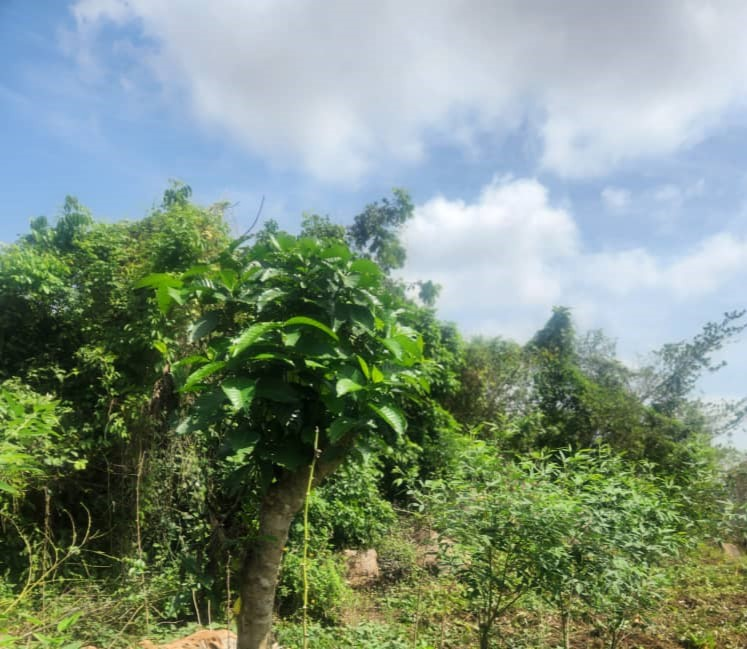

---

title: Revolutionizing Nigerian Agriculture with AgriFood Technologies
publish_date: 2023-11-27
abstract: In response to the Federal Ministry of Agriculture and Food Security's "Application of UAV, IoT, and AI to Agriculture in Nigeria" initiative, this post discusses how Robavo AgriFood Technologies can be a game-changer in revolutionizing Nigerian agriculture. It delves into current challenges such as market fragmentation, rising costs, and climate change, critically assesses governmental strategies, and proposes a collaborative approach for sustainable agricultural innovation and investments on the Nigerian agricultural sector.

---

  

1. **Africa and Nigeria Farming Market**

The farming market in Africa, and particularly in Nigeria, is notably fragmented. Agriculture is a critical sector in Africa, employing about 70% of the continent's population in various roles. In Nigeria, the agricultural sector plays a substantial role in the economy, employing over 35% of the workforce and contributing more than 20% of the GDP.This is particularly noteworthy when compared to Ethiopia, where agriculture makes up an even larger portion, accounting for 40% of their GDP. A significant aspect of this sector is the dominance of small-scale women farmers; they constitute 70% of the agricultural workforce and produce 60% of the food consumed in Nigeria. My mother, a smallholder farmer herself, is part of this significant demographic. [1].

2. **Personal Experience and Market Changes**

Farming in Nigeria is not only becoming more expensive but is also fraught with numerous challenges, as observed through my mother's experiences. Economic costs are escalating, with input prices for farming essentials rising faster than what the crops can fetch in the market. The burden is compounded by the rising costs of transportation, which affect everything from acquiring supplies to getting produce to the market. Environmental challenges, such as frequent floods in Benue and droughts in Bauchi, further strain the farmers' ability to maintain consistent productivity. Security concerns, stemming from attacks by [herders](https://guardian.ng/features/agro-care/ondo-farmers-under-siege-seek-end-to-herders-carnage/) and [Boko Haram/ISWAP terrorist groups](https://www.voaafrica.com/a/at-least-11-farmers-killed-by-jihadists-in-northeast-nigeria/7344209.html), add another layer of difficulty to their daily lives. These issues are compounded by problems like low productivity and limited technology adoption, exacerbated by the increasingly unpredictable weather patterns due to climate change.

Another significant challenge faced by smallholder farmers in Nigeria is land access and security. Under the [Nigeria Land Use Act](https://placng.org/lawsofnigeria/view2.php?sn=228), the government retains ownership of all lands, which can lead to situations where, despite legal land ownership, farmers can be displaced for government projects like road construction. My mother's story is a case in point; her first farm at Olu Foam, a source of pride, was taken away by the Ondo State government in 2008 under this Act, illustrating the precarious nature of land tenure for farmers in Nigeria.

Most Nigerian farmers, including my mother, are smallholders. She runs a small farm and has always been a part of the local agricultural community. One vivid aspect of this community is the 'Oja Oko,' a term in Yoruba language, predominantly spoken in Southwestern Nigeria, meaning 'bush market.' Oja Oko is akin to a farmer's market, where everyone brings their produce and food to sell. These markets, characteristic of rural Nigeria, are convened on specific market days. My mother used to find affordable produce at these markets, but recently, she mentioned that prices have risen sharply, now mirroring those in urban centers. This increase is primarily due to Nigeria's fluctuating naira and high inflation rates. Such economic pressures, combined with land tenure challenges, paint a vivid picture of the multifaceted struggles facing Nigerian farmers today.

3. **Reaction to the Agriculture Demonstration Project and Call for Applications**
                                                          

The Agriculture Demonstration Project, introduced by the Federal Ministry of Agriculture and Food Security, represents a significant and much-needed step towards advancing the adoption of agricultural technology in Nigeria. Currently, the landscape of agrifood technology companies in Africa, including Nigeria, shows a distinct trend. Companies like ThriveAgric in Nigeria, focusing on agribusiness marketplaces and fintech, and Wasoko in Kenya, specializing in in-store retail and restaurant technology, reflect the predominant focus areas in the sector. According to the [AgFunder Africa AgriFoodTech Investment Report 2023](https://research.agfunder.com/africa-agrifoodtech-investment-report-2023-08f5446bc7224fd5a3ce21f4451889f1.pdf), there has been more funding directed towards sectors like retail, marketplaces, and fintech than towards areas like mechanization and equipment, farm management software, IoT, and sensing​, which is why I was particularly excited about the [call for applications](https://x.com/bosuntijani/status/1729147958610797009?s=20). My enthusiasm stems from two key reasons:

- First, there are numerous startups and government initiatives in Nigeria that are addressing crucial issues like connecting producers with consumers, providing access to financing for farmers, and offering rental tractors. In fact, the Nigerian government, at both the state and federal levels, has a history of providing micro-financing, farm equipment, and farm inputs to farmers. I recall, during Governor Olusegun Mimiko's administration in Ondo State, the Ondo State Radiovision Corporation showcase his commissioning of the [Ore Agric Village](https://www.vanguardngr.com/2014/03/investing-agriculture-mimiko/) and they frequently had news segments where his commissioners were shown distributing [micro-loans]((https://dailytrust.com/ondo-gives-n23-9-million-to-70-young-farmers/)), [farm inputs]((https://allafrica.com/stories/201609140081.html)), and [farm equipment like tractors with disc plough, burrow, ridger, and tipping trailer](https://allafrica.com/stories/201403242053.html) to farmers. However, these initiatives often faced challenges such as lack of proper post-disbursement monitoring, accountability issues among some farmers, and inadequate enforcement by the government. From discussions with my mother's friend, it was clear that sometimes the farm inputs distributed to smallholder farmers arrived late. There are documented instances where Nigerian farmers used loans from the Bank of Agriculture and other government-funded programs for personal expenses like [throwing large parties or marrying new spouses](https://commodity.ng/warning-nigerians-against-taking-out-loans-to-get-married-or-throw-parties-bank-of-agriculture-claims-to-have-n243-million-in-debt/). There have also been cases of government officials in Nigeria [diverting government farm equipment for profit](https://humanglemedia.com/officials-are-diverting-government-tractors-for-profit-in-nigerias-borno-state/), by charging high rental prices for equipment that was meant to be loaned out cheaply to support farmers. There are also cases of farmers and government officials [side-selling and diverting farm inputs](https://dailypost.ng/2023/11/27/wheat-farming-fg-warns-against-selling-diversion-of-dry-season-inputs/). Some suppliers also sell [fake agricultural inputs in Nigeria and across Africa](https://businessday.ng/news/article/fg-sensitises-agro-stakeholders-on-spread-of-fake-agricultural-inputs/). They will paint the seed in a different color to deceive the buyers.

Second, the collaboration between the Federal Ministry of Agriculture and Food Security and the Federal Ministry of Communications, Innovation, and Digital Economy on this intervention is particularly noteworthy. It signifies a move away from outdated and inefficient agricultural practices towards the latest advancements in agricultural investments and innovation. This collaborative approach is vital as it demonstrates the application of UAV, IoT, AI, and Blockchain to agriculture in Nigeria, aiming to mainstream these technologies to revolutionize the sector and improve the livelihoods of millions of Nigerians. This is the first time I am reading about such an inter-ministry collaboration in Nigeria, which is a welcome development considering how the U.S Department of Agriculture has been striving to accelerate innovative technologies for water and agriculture-related resources. Since as far back as 2002, the USDA established the Rural Business Investment Company to promote job creation and agricultural technology adoption in rural America. Similarly, the U.S. has a Farm Credit System, comprising banks and lending institutions federally chartered to serve agriculture and the rural economy, akin to Nigeria's Bank of Agriculture.
