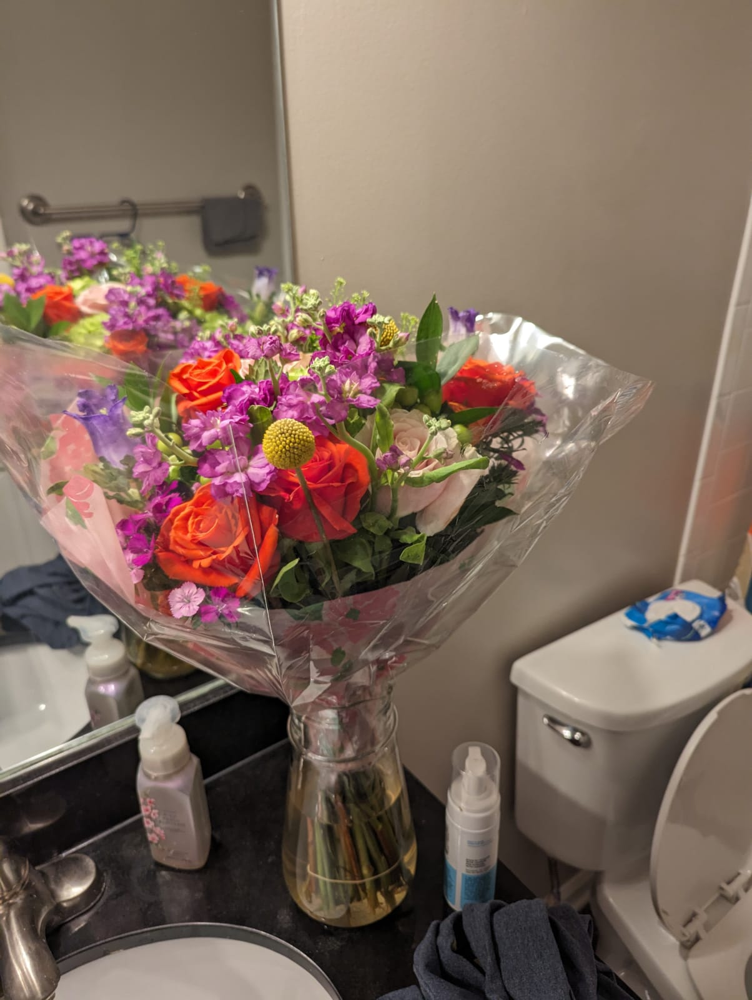

## Introduction

Love has a profound way of shaping our lives. It can lead us down paths we never anticipated, challenge us in ways we never expected, and transform us in ways we never imagined. My first journey down this winding path of love was anything but conventional.

Prior to September 12, 2022, my life was bereft of romantic entanglements. I had never experienced the heady rush of a first date or the warmth of a stolen kiss. But destiny has a peculiar sense of humor. It chose to thrust me headfirst into the deep end, from never having dated to standing before a court clerk, saying 'I do'.

Our wedding was held not amidst the chatter of relatives and the aroma of flowers but within the solemn, hallowed halls of a courthouse. This wasn't a spontaneous dash to a Vegas chapel or an impulsive declaration of young love. Our marriage was born out of pragmatism, a solution to a difficult situation we found ourselves tangled in. But amidst the legal documents and quick vows, we made a solemn pact to commit to this marriage fully. We were determined to give this partnership a fighting chance, to prove to ourselves and the world that our bond was not merely ink on a marriage certificate but a bond of love and mutual respect.

And for a while, it felt like we might succeed. Like any couple, we had our disagreements, but they seemed nothing out of the ordinary. I was in it for the long haul, ready to weather whatever storms came our way.

**Then, the storm hit.**

