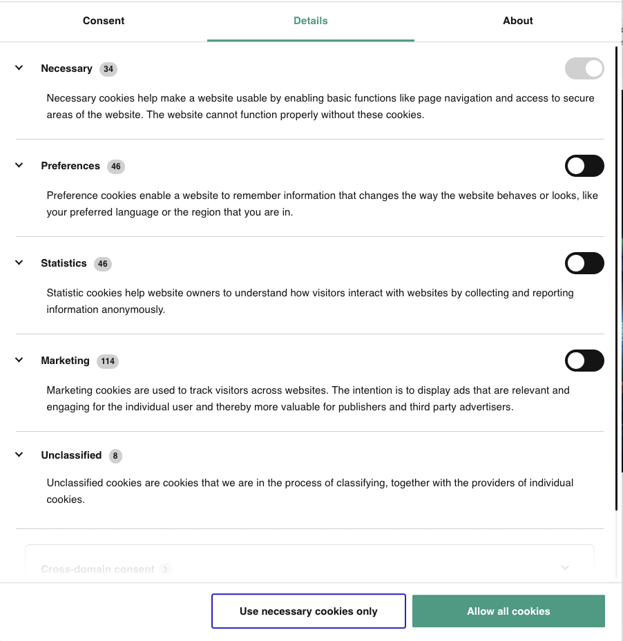

### Introduction
You have probably noticed the familiar pop-up on many websites you visit, asking "This website uses cookies - Accept or Reject?" Most of us click 'Accept' without a second thought, but have you ever wondered what exactly you're consenting to? Don't worry, we will delve into these 'digital cookies' and why they are so vital in the online world in this post.

### What are Cookies on Websites?
Imagine going to a popular market where all the sellers know you. As you walk past each stall, the sellers greet you by name, remember what you bought last time, and suggest items based on your previous purchases. This makes your shopping experience smooth and personalized.

The internet works similarly, but instead of market sellers, we have websites, and instead of their memories, we have cookies.

In the digital world, a 'cookie' is not a delightful dessert but small files of information that a web server generates and sends to the web browser we use. They are small notes websites leave on our device (phone, computer, etc.) to remember things about us. These might be what we've put in our shopping basket, our preferred language, or the fact we've logged in

### Why are Cookies Used?
Cookies help inform websites about the user, enabling the websites to personalize the user experience. They allow websites to 'remember' users across different pages or during subsequent visits. 

Just like a market seller remembering your previous purchases to make your shopping easier, cookies help websites remember your actions and preferences. This means you don't have to keep re-entering them whenever you come back to the site or browse from one page to another.

For example, let's say you're shopping online for a football jersey. You select a size, add it to your cart and decide to keep shopping. The website uses cookies to remember what's in your cart, so even if you leave the site and come back later, your jersey is still there waiting for you.

## Different Types of Cookies
It's essential to remember that not all cookies are created equal. Some cookies, often termed 'First-party cookies', are created by the site you visit and help the site function correctly. For example, they enable you to add items to your shopping cart or change your site's layout. However, 'Third-party cookies' are created by other sites, like advertisers, which track your browsing activities to deliver tailored content and ads.

**Digital cookies come in various flavors:**

- Session Cookies: These are like daily notes. These cookies keep track of your actions within a website during a browser session. Once you exit the browser, session cookies are deleted.

- Persistent Cookies: These are like sticky notes. These cookies are stored on your device between browsing sessions and keep track of your preferences or actions across multiple sites or browsing sessions.

- Authentication Cookies: These notes confirm it's really you. The cookies are generated when you log into an account via your browser, these cookies ensure that sensitive information is delivered to the correct user sessions.

- Tracking Cookies: Typically used by advertisers, these cookies record user activity for marketing purposes.

- Zombie Cookies: These cookies regenerate after being deleted, often used by unscrupulous networks and even cyber attackers.

### Cookies: Friend or Foe?
While cookies are essential for a user-friendly web experience, some concerns arise regarding privacy and data protection. They have the potential to record your browsing activity, including your visits and actions on various websites. This tracking information can then be used for targeted advertising or analytics.

### A Glimpse into Global Data Protection Acts and Your Choices
Countries worldwide, including the EU and Nigeria, have enacted data protection legislation. These laws require businesses to be transparent about their data collection practices, and in some cases, to obtain user consent before activating cookies.

This means you, as an internet user, are more empowered than you think. You have the right to know how your data is being used, to object to its processing, and to withdraw your consent at any time. If you're uncomfortable with cookies tracking your data, it's within your rights to reject them.

