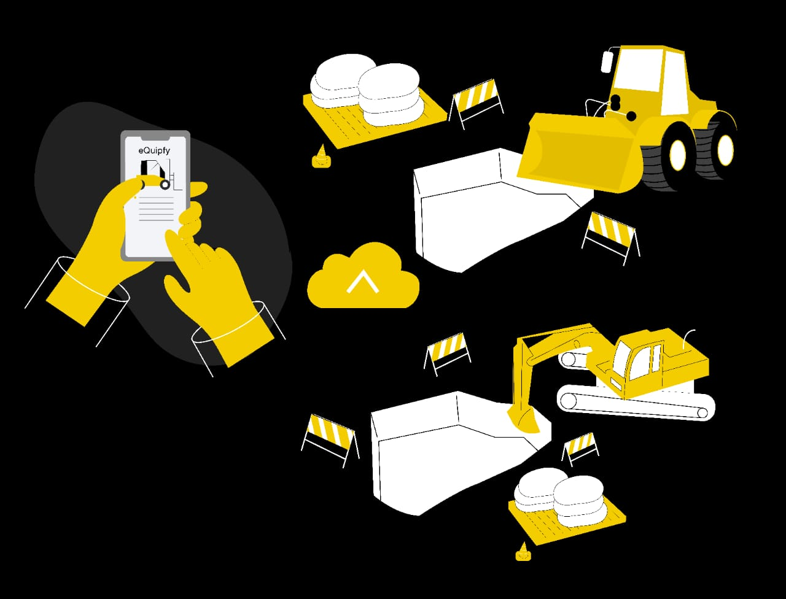

## Abstract

This paper examines the prevalent challenges in the used heavy equipment market within Sub-Saharan Africa, with a particular focus on Nigeria, a nation where traditional sales methods pose significant inefficiencies. Drawing upon first-hand knowledge and extensive field research, the study illuminates the shared difficulties encountered by equipment sellers, buyers, renters, and part sellers within the existing marketplace. A digital solution, in the form of [eQuipfy Technologies](https://equipfy.vercel.app/), is proposed as a tool to ameliorate these issues, fostering improved market efficiency, enhancing transparency, and promoting increased profitability. The validity of this solution is supported by a pilot testing phase that saw successful transactions facilitated through a WhatsApp group. The results affirm the proposed hypothesis, underscoring the potential of digital platforms to significantly overhaul and improve the Nigerian heavy equipment market. Furthermore, this research suggests that the application of this digital strategy may extend to the broader heavy equipment industry across Sub-Saharan Africa, heralding a transformative shift in the region's construction sector.

## Introduction

