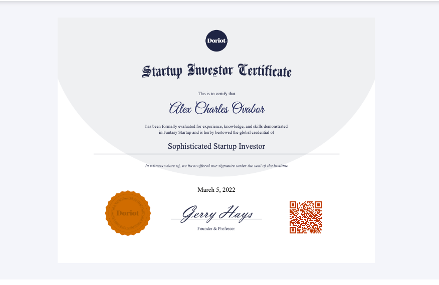

In this piece, I'll share my journey into tech entrepreneurship, venture capital, and invention, and the resources that guided me. I hope it's just as interesting for you as it was for me!

My adventure started in 2020 with Future VC's Virtual Masterclasses, where I learned the nitty-gritty of venture capital. I was fortunate to work alongside Rohit, a cybersecurity investor at Plug and Play during the program, and later, I had the opportunity to work as a [VentureCorps Analyst](https://www.crunchbase.com/person/alex-ovabor) at AVG and as an [Operations Associate/Chief of Staff](https://www.roundtripafrika.com/people) at Roundtrip.

In March 2022, I completed Doriot Academy's Startup Investing Course and became a [Sophisticated Startup Investor](https://www.credential.net/06e4482c-1f2c-464f-a902-61f01c7d4469#gs.0rn94q). 

Then, in early 2021, I took a big step and started [Robavo Expeditions](https://www.robavo.xyz) and [Ovabor Development Labs](https://www.ovabor.xyz), where I work on civic and deep tech projects with some of the brightest minds in tech and design.

**I owe a lot of my learning and growth to the Future VC team, Rohit, Hillary, Timi, Gigi, and Olumide.**

## My Role at Ovabor Labs: Building and Growing Ideas

At Ovabor Labs, our mission is to create the next wave of groundbreaking civic and deep tech companies. I spend a lot of my time coming up with and testing new ideas.  I also work on making the lab better through learning experiments and big ideas. My job involves planning the way forward and checking the ideas for any technical, business, or product risks. It's also my job to decide whether to go ahead with or drop an idea. 

**We have a robust process in place that either validates these ideas or, if they don't measure up, ruthlessly discards them.**
The best ideas undergo an iterative product development process, with our sights constantly trained on their potential to evolve into businesses worthy of venture backing. When we're fully confident about a business concept's potential, we invest substantial time and resources to transform these ideas into venture-funded companies that quickly find favour with customers and markets.

I also keep up-to-date with scientific research, articles, and patents that are related to what we do at Ovabor Labs. I keep an eye on market trends, competition, and important changes in the industry. I work to connect with important people, competitors, and experts, and I make investment plans based on our research.

For each project, I look at the key scientific and technical risks. I also identify who could be competitors or partners for the project. I check the project's R&D plan and business strategy, and help prepare notes for internal investment meetings, which includes making pitch decks.

## Blockquote

> “ARD in making an investment is in no way ‘gambling.’ Gambling is win or lose; ARD is the opposite, invest and build” - Georges Doriot

***
## Venture Investing
- [**Venture Capital Vocabulary**](https://www.vcguide.co/vocab)
- [**Making Sense of Venture Capital by AngeList Venture**](https://learn.angellist.com/)
- [**Breaking into Venture**](https://cowboy.docsend.com/view/qecthfnxpn9jy3gd)
- [**Navigating Your First Year in Venture Capital**](https://cowboy.docsend.com/view/244ssbxc852yf526)
- [**Sourcing Strategies**](https://cowboy.docsend.com/view/njqz2rjdkwwigd2t)
- [**Introduction to Venture Capital Course**](https://ripplexfellowship.thinkific.com/courses/public)
- [**Venture Capital Guidebook**](https://docsend.com/view/dvufhb27r5bzrpym)
- [**The Complete Guide to SAFEs**](https://joshephraim.medium.com/complete-guide-to-understanding-safes-how-we-invest-at-dorm-room-fund-bbb37855ec4e)
- [**Venture Capital for the Future**](http://www.visionpioneers.net/Venture%20Capital%20for%20the%20Future.pdf)
- [**Investing Book Reading List**](https://gavin-baker.medium.com/investing-book-list-5fba1b80728d)
- [**Equal Ventures New Investor Required Reading List**](https://medium.com/@EqualVentures/venture-investing-101-equals-required-reading-list-for-new-hires-9bfdf5408802)
- [**Reading list for Associates and Analysts in Private Equity and Venture Capital](https://teten.com/onboarding-new-private-equity-venture-capital-analysts-and-associates/)
- [**The Venture Capital Blueprint by Front Row Ventures**](https://academy.frontrow.ventures/courses/vcblueprint)
- [**Kirima’s Conceivation Resources**](https://cantosvc.notion.site/Kirima-s-Conceivation-Resources-87361261693c46388c49f1637e6de5b3)

## Venture Building
- [**How to Start a startup by Sam Altman**](https://startupclass.samaltman.com/)
- [**YC Startup Resource Library**](https://www.ycombinator.com/library)
- [**High Output Founder Library**](https://www.founderlibrary.com/)
- [**Startup Secrets by Underscore VC**](https://underscore.vc/startupsecrets/)
- [**Founder Playlist by Pillar VC**](https://www.pillar.vc/playlist/)
- [**Stripe Atlas Guides**](https://stripe.com/atlas/guides)
- [**Startup Field Guide by Unusual Ventures**](https://www.field-guide.unusual.vc/)
- [**Venture Hacks: Advice for startups by Naval and Nivi**](https://venturehacks.com/)
- [**How to Fundraise by Pear VC**](https://blog.pear.vc/category/fundraising/)
- [**Resources for Startups Chief Technology Officers and VP R&D by Dima Kuchin**](https://github.com/kuchin/awesome-cto)
- [**Lenny Rachitsky’s Product Newsletter**](https://www.lennyrachitsky.com/)
- [**Lenny Rachitsky's Favorite Product Management Templates**](https://www.lennysnewsletter.com/p/my-favorite-templates-issue-37?utm_source=url)
- [**Top 100 Resources for Product Managers**](https://www.sachinrekhi.com/top-resources-for-product-managers)
- [**Engineering 101 for Product Managers**](https://www.lennysnewsletter.com/p/the-top-5-things-pms-should-know?s=r)
- [**Sean Sullivan's ProductFix Newsletter**](https://productstride.substack.com/archive)
- [**Future Newsletter by a16z**](https://future.a16z.com/)
- [**Paul Graham Essays**](http://www.paulgraham.com/articles.html)
- [**Julian Shapiro Essays**](https://www.julian.com/blog)
- [**Founding Sales - The Early Stage Go to Market Handbook**](https://docs.google.com/document/u/1/d/1ZHCSm5yUAGhdpDH9VFTPS271LZ-RgF3YHkvZQePxGnM/mobilebasic)
- [**Content Marketing for Founding Teams**](https://www.notion.so/Content-marketing-for-founding-teams-fd1c96b0ef9840b29088b5385603ff12)

## Additional Reading
- [**Foundations of Humane Technology**](https://www.humanetech.com/course)
- [**Entrepreneurship is Contagious**](https://www.newthingsunderthesun.com/pub/uhudflze/release/8?readingCollection=9f57d356)
- [**The Idea of Being an Entrepreneur**](https://www.newthingsunderthesun.com/pub/3h93inee/release/6?readingCollection=9f57d356)
- [**So, why are Software Engineers Better CEOs?**](https://iism.org/article/so-why-are-software-engineers-better-ceos-60)
- [**Anthropic Bias: Observation selection Effects in science and philosophy**](https://www.anthropic-principle.com/q=book/table_of_contents/)
- [**Nineteen Eighty-Four by George Orwell**](https://gutenberg.net.au/ebooks01/0100021.txt)
- [**Writing Well by Julian Shapiro**](https://www.julian.com/guide/write/intro)
- [**How Jeff Bezos Turned Narrative into Amazon's Competitive Advantage**](https://slab.com/blog/jeff-bezos-writing-management-strategy/)
- [**Why Everyone on Your Team Should Strive for Good Writing**](https://slab.com/blog/writing-in-workplace/)
- [**Jeff Bezos 1997-2020 Shareholder Letters**](https://ir.aboutamazon.com/annual-reports-proxies-and-shareholder-letters/default.aspx)
- [**Berkshire Hathaway Inc. 1965-2020 Shareholder Letters**](https://www.berkshirehathaway.com/letters/letters.html)
- [**Memo Collections by Sriram Krishnan**](https://sriramk.com/memos)
- [**It's Time to Build by Marc Andreessen**](https://future.a16z.com/its-time-to-build/)
- [**The Pmarca Blog Archives by Marc Andreessen**](https://a16z.com/wp-content/uploads/2021/08/The-pmarca-Blog-Archives.pdf)
- [**How to Build a Breakthrough by Mike Maples, Jr**](https://medium.com/@m2jr/how-to-build-a-breakthrough-3071b6415b06)
- [**Science, The Endless Frontier:A Report to the President by Vannevar Bush**](https://www.nsf.gov/od/lpa/nsf50/vbush1945.htm)
- [**How to Choose a Career by Julian Shapiro**](https://www.julian.com/blog/life-planning)
- [**Advice for Ambitious Teenagers by Laura Deming**](https://ldeming.posthaven.com/advice-for-ambitious-teenagers)
- [**Advice for Young Scientists—and Curious People in General**](https://fs.blog/advice-for-young-scientists/)
- [**10 Tips for Research and a PhD by Sebastian Ruder**](https://ruder.io/10-tips-for-research-and-a-phd/)
- [**How to be Succesful by Sam Altman**](https://blog.samaltman.com/how-to-be-successful)
- [**How to Get Rich by Naval**](https://venturehacks.com/get-rich)
- [**The Effective Altruism Handbook by Aaron Gertler**](https://forum.effectivealtruism.org/posts/cN9Zu7dowefAfmNnH/the-effective-altruism-handbook#1__The_Effectiveness_Mindset)
- [**Need a New Science of Progress**](https://www.theatlantic.com/science/archive/2019/07/we-need-new-science-progress/594946/)
- [**Fallibility, Reflexivity, and the Human Uncertainty Principle by George Soros**](https://www.georgesoros.com/2014/01/13/fallibility-reflexivity-and-the-human-uncertainty-principle-2/)
- [**Morning Brew Favorite College Graduation Speeches**](https://www.morningbrew.com/daily/stories/2020/05/15/favorite-college-graduation-speeches)
- [**Modeling the Human Trajectory by David Roodman**](https://www.openphilanthropy.org/blog/modeling-human-trajectory)
- [**Dan Wang 2021 Letter**](https://danwang.co/2021-letter/)
- [**An Engineer's View of Venture Capitalists**](https://spectrum.ieee.org/an-engineers-view-of-venture-capitalists)
- [**Tech in Africa by Mario Gabriele**](https://www.readthegeneralist.com/briefing/africa#toc-demographics-2)

