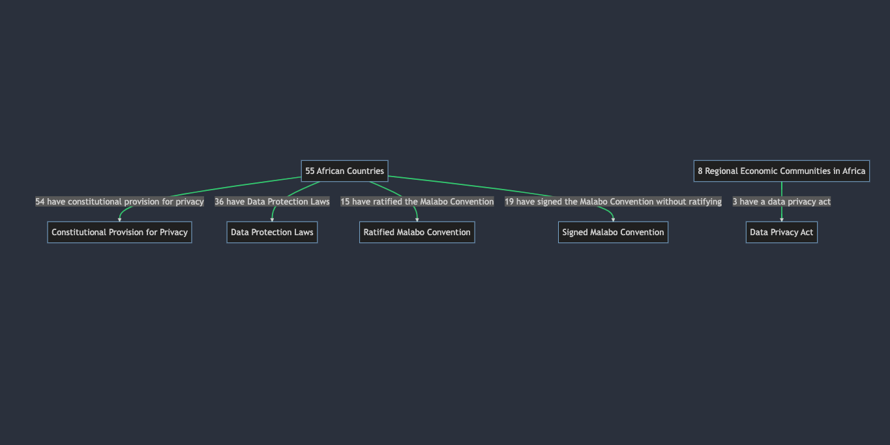
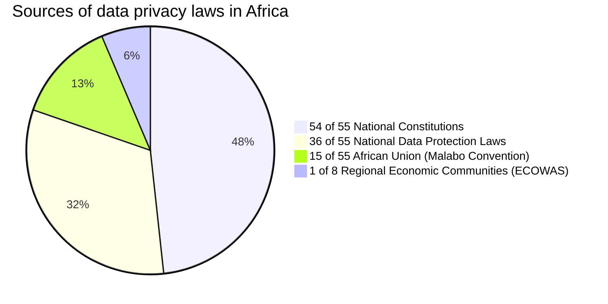

# Abstract
This paper explores the dynamic, complex, and uneven landscape of data protection and privacy laws in Africa at different jurisdictional levels: continental (African Union Convention on Cyber Security and Personal Data Protection), national (e.g., Nigeria Data Protection Regulation, South Africa's Protection of Personal Information Act), and regional (e.g., ECOWAS Supplementary Act on Personal Data Protection). As of May 2023, 36 African nations have enacted specific data protection laws, illustrating a burgeoning interest in data governance and significant legislative advancements. However, the marked disparities in enforcement mechanisms, scope, and effectiveness of these laws underscore the necessity for greater harmonization. This paper offers an in-depth analysis of the data protection policies in Congo Republic, Rwanda, Mauritania, Zambia, and Nigeria, highlighting the urgent need for unified data privacy legislation to enable cross-border data transfers and stimulate socio-economic development in the digital era. The paper also delves into the role of contemporary technological tools, such as machine learning, artificial intelligence (AI), and generative AI in bolstering data protection and privacy compliance. The paper posits these tools as potential aids for Data Protection Authorities (DPAs) in their enforcement roles, despite the challenges DPAs face, including lack of independence, resources, and transparency. Finally, the paper proposes the creation of a comprehensive tool for automating data security and privacy compliance, providing a practical solution to existing challenges for businesses, developers, and data protection officers across Africa. This research underscores the need to address these complexities and harness modern technology to guide Africa's digital future and socio-economic development.


**CCS CONCEPTS**
• Security and privacy → Laws, regulations, and standards; Privacy protections;
• Applied computing → Law, social and behavioral sciences;

**KEYWORDS**
Data Protection; Data Privacy; Cybersecurity; Africa; Data Protection Laws; Artificial Intelligence; Machine Learning; Generative AI; Malabo Convention; GDPR; Regulatory Compliance

ACM Reference Format:
Alexander C. Ovabor. 2023. "Towards Harmonizing Data Protection Laws in Africa: Challenges, Opportunities, and the Role of AI." In Proceedings of the ACM on Measurement and Analysis of Computing Systems, Vol. X, No. X, Article X (Month Year), Pages X–X. ACM, New York, NY, USA. DOI: https://doi.org/10.1145/nnnnnnn.nnnnnnn


## Introduction

As a continent composed of 55 recognized nations, Africa is at a critical juncture of a significant digital transformation, driven by factors such as burgeoning eCommerce and fintech sectors, a vibrant tech talent pool, a substantial increase in mobile penetration, and pro-innovator regulations. This transformation is unfolding against a backdrop of a rapidly growing population, presently over 1.3 billion and projected to reach 2.5 billion by 2050, and an expanding tech ecosystem spread across five geographic regions and eight regional economic communities.

Simultaneously, global regulatory shifts such as the introduction of the European Union's General Data Protection Regulation (GDPR) in 2016 have spurred a surge of interest and substantial growth in data governance initiatives throughout the continent. While in 2016, only 16 of the 55 African Union member states had enacted specific data protection laws, this number has more than doubled by May 2023, rising to 36.

However, the pace of digital transformation and the burgeoning legislative initiatives have not eradicated the complexities posed by the absence of a unified data privacy law applicable across all member states. The outcome is a mosaic of laws and regulations, varying in scope, enforcement mechanisms, and effectiveness, resulting in businesses grappling with understanding their data privacy obligations under multiple regulatory regimes.

This paper provides a comprehensive exploration of this complex landscape, dissecting the diverse sources of data protection laws across Africa and reviewing the current status of data protection in individual African nations. The continental initiatives, such as the African Union Convention on Cyber Security and Personal Data Protection (The Malabo Convention 2014) ratified by 15 countries and signed by 19 others, are examined, illuminating the opportunities and challenges they present for a harmonized data protection framework.

As of 2023, Africa has more than 526 million internet users. This digital revolution necessitates robust data protection and privacy mechanisms to safeguard users' rights and foster trust in digital platforms. The Malabo Convention serves as a foundational framework for harmonizing data privacy laws across the continent. However, its alignment with the now-repealed EU Data Protection Directive 95/46/EC rather than the current GDPR puts its continued applicability under scrutiny.

Recognizing these challenges, this paper argues for the urgency of a harmonized, robust, and effective data protection regime that aligns with international standards and considers Africa's unique socio-economic, political, and cultural contexts. Furthermore, this paper posits that emerging technologies such as machine learning, artificial intelligence (AI), and generative AI offer promising avenues for enhancing data protection mechanisms in Africa. These technologies can aid in automating data security and privacy compliance, thereby supporting businesses, developers, and Data Protection Authorities (DPAs) in ensuring adherence to data protection laws.

However, actualizing this potential is not without its challenges. Resource limitations, lack of transparency, and the need for increased awareness and capacity building are key issues that must be addressed. In this paper, we explore these challenges, the current state of data privacy laws in Africa, and propose strategies for leveraging advanced technologies to facilitate a harmonized and effective data protection regime in Africa, driving its digital future, and promoting socio-economic development.


## Tracing the Path of Data Protection Legislation in Africa: Influence, Evolution, and Challenges
On January 22, 2001, the Republic of Cape Verde made history by becoming the first African nation to implement a thorough data protection law. The legislation was inspired by the pre-existing data protection laws of the European Union at the time: Directive 95/46/EC and Council of Europe Convention 108. The Cape Verdean legal system, primarily influenced by Portugal, adopted these models to create its own data protection framework.

Subsequent years saw significant developments in the African data protection laws and regulations landscape. In November 2008, the East African Community (EAC) embraced the EAC Legal Framework for Cyberlaws EAC 1 and EAC 2, supported by the United Nations Conference on Trade and Development. A month later, the HIPSSA–Data Protection: SADC Model Law project, also known as "Support to the Harmonisation of ICT Policies in Sub-Sahara Africa," was unveiled by the Southern African Development Community (SADC) in Addis Ababa. This initiative was financially supported by the European Union.

By Febraury 2010, the Economic Community of West African States (ECOWAS) implemented the Supplementary Act A/SA. 1/01/10 on Personal Data Protection. This act shared significant similarities with the European Union's Data Protection Directive to some extent. On June 27, 2014, a landmark event occurred when 55 African heads of state adopted the African Union Convention on Cyber Security and Personal Data Protection (Malabo Convention). This Convention took significant inspiration from the EU Data Protection Directive, which was later replaced by the General Data Protection Regulations (GDPR) in 2018.
 
Looking at the historical trends in data protection laws in the table below, we can see that Africa has come a long way since 2001. Initially, only 16 of the 55 African countries had data protection laws. 

| Year | Country      | Data Protection Law Enacted |  
|------|--------------|------------------------------|
| 2001 | Cabo Verde   | Yes                          | 
| 2003 | Seychelles   | Yes                          |
| 2004 | Burkina Faso | Yes                          | 
| 2004 | Tunisia      | Yes                          | 
| 2008 | Senegal      | Yes                          | 
| 2009 | Morocco      | Yes                          | 
| 2009 | Zambia       | Yes                          | 
| 2011 | Angola       | Yes                          | 
| 2011 | Gabon        | Yes                          | 
| 2011 | Lesotho      | Yes                          | 
| 2012 | Ghana        | Yes                          | 
| 2013 | Côte d’Ivoire| Yes                          | 
| 2013 | Mali         | Yes                          | 
| 2013 | South Africa | Yes                          |             
| 2015 | Chad         | Yes                          | 
| 2015 | Madagascar   | Yes                          | 

**European Union's General Data Protection Regulations (GDPR) Effect**
The General Data Protection Regulations (GDPR) was passed in 2016 and came into effect on May 25, 2018. With the implementation of GDPR in 2016, four African nations—Equatorial Guinea, Guinea, Rwanda, and São Tomé and Príncipe— also enacted their own data protection laws. Between 2017 and 2023, 16 other countries followed suit, showing the increasing commitment of African countries to data protection and privacy as shown in the table below:

| Year | Country   | Data Protection Law Enacted |
|------|-----------|-----------------------------|
| 2017 | Benin     | Yes                         |
| 2017 | Mauritania| Yes                         |
| 2017 | Mauritius | Yes                         |
| 2017 | Niger     | Yes                         |
| 2018 | Algeria   | Yes                         |
| 2018 | Botswana  | Yes                         |
| 2019 | Kenya     | Yes                         |
| 2019 | Nigeria   | Yes                         |
| 2019 | Togo      | Yes                         |
| 2019 | Uganda    | Yes                         |
| 2020 | Egypt     | Yes                         |


Several African nations have updated their existing data protection laws following the introduction of the GDPR, explicitly aiming to align their privacy regulations with the new EU framework. Some of these countries include Nigeria, which replaced its Data Protection Guidelines from 2013 with the Data Protection Regulation in 2019, and Cape Verde, which passed a law in 2021 to amend its Data Protection Act from 2001. Burkina Faso also repealed its 2004 Act and replaced it with the Data Protection Act of 2021. Similarly, Mauritius revised its 2004 Data Protection Act in 2017, a move that was followed by the creation of a new data protection authority. Likewise, in 2020, South Africa enacted the Protection of Personal Information Act (POPIA), which was proposed back in 2013. 

Many of these new legislations incorporate key elements of GDPR, especially the rights of individuals and the obligations of entities controlling or processing data. The Cape Verde 2021 Amendment, for example, introduced more comprehensive rights for individuals, closely aligned with GDPR, such as the right to erasure, restriction of processing, and data portability. Burkina Faso's Data Protection Act of 2021 took a step further to reinforce security requirements.


On the whole, the progression of data protection legislation in Africa reveals a significant influence from the European Union's laws, which has inspired not only African nations but also countries like Japan, Israel, Brazil, India, Canada, Russia, and several states within the United States. However, it is worth noting that while substantial progress has been made in many countries across Africa, a few nations are yet to introduce comprehensive data protection laws. Some countries only have fragmented legislation regarding privacy or data protection in the context of certain sectors or specific issues, while others do not have any legal provisions at all.

Today, Africa can claim one continental data protection legislation, four regional economic communities with their own respective legislation or framework, and 36 countries with individual data protection laws. Out of the 55 countries in Africa, 54 nations have a constitutional provision for privacy, albeit generic. The variety within these frameworks and laws presents an intricate mosaic of regulatory landscapes, creating challenges in harmonization, collaboration, and coordination.


## Delving into the Malabo Convention


| Country | National Data Protection Law | Year of Enactment | Applies to | Penalty for Non-Compliance | Data protection law in force | Data Protection Authority Appointed | Constitutional Provision for Privacy | Ratification Status of AU Privacy Law |
| --- | --- | --- | --- | --- | --- | --- | --- | --- |
| Algeria | Yes / Law Nr 18-07 | June 10, 2018 | Data controllers, processors, or holders who handle personal data | Fine up to DZD 500,000 | Yes | Yes | Article 47 | - |
| Angola | Yes / Law No. 22/11 | June 17, 2011 | Data controllers based or operating in Angola | Monetary penalties of up to USD 150,000 | Yes | Yes | Article 32 | Ratified (11 May 2020) |
| Benin | Yes / Law No. 2009-09 | May 22, 2009 | All persons that process the personal data in Benin | 5 to 10 years imprisonment; CFA 10 million to 50 million fine | Yes | Yes | Article 21 | Signed |
| Botswana | Yes / Data Protection Act 2018 | August 03, 2018 | Data controllers who process the personal data of Botswana citizens | Imprisonment of up to 10 years, fine not exceeding P 1,000,000 | Yes | Yes | - | - |
| Burkina Faso | Yes / Law No. 010-2004/AN | April 20, 2004 | Data controllers and data processors operating within Burkina Faso | Imprisonment from 6 months to 5 years; CFA 500,000 to CFA 5 million | Yes | Yes | - | Revision not passed yet |
| Cape Verde | Yes / Law 133/V/2001 | January 22, 2001 | Data controllers with no presence in Cape Verde, as long as they process the data of individuals located in the country | Imprisonment of up to 2 years or a fine of up to 240 days | Yes | Yes | - | Ratified (5 February 2022) |
| Chad | Yes / Law No. 007/PR/2015 | February 10, 2015 | Data controllers who handle the personal data of individuals | Fine ranging from XAF 1 million to XAF 10 million and imprisonment ranging from 3 months to 1 year | Yes | Yes | - | Signed |
| Egypt | Yes / Data Protection Law Resolution No. 151 of 2020 | October 15, 2020 | Data controllers, processors, or holders who handle personal data | Fine of maximum 5,000,000 Egyptian Pounds or imprisonment of up to 3 years | Yes | Yes | - | - |
| Equatorial Guinea | Yes / Personal Data Protection Law No. 1/2016 | July 2016 | Public and private sectors who handle the personal data of individuals | N/A | Yes | Yes | - | - |
| Gabon | Yes / Law No. 001/2011 | September 25, 2011 | Data controllers and data processors operating within the Gabon territory | Suspension of a data controller or processor’s activities of up to two months; fine ranging from XOF 1 million to XOF 100 million | Yes | Yes | - | - |


| Country | National Data Protection Law | Year of Enactment | Applies to | Penalty for Non-Compliance | Data protection law in force | Data Protection Authority Appointed | Constitutional Provision for Privacy | Ratification Status of AU Privacy Law |
| --- | --- | --- | --- | --- | --- | --- | --- | --- |
| Algeria | Yes / Law No. 18-07 | June 10, 2018 | Data controllers, processors, or holders who handle personal data | Fine up to DZD 500,000 | Yes | Yes | Article 47 | - |
| Angola | Yes / Data Protection Law (Law No. 22/11) | June 17, 2011 | Data controllers based or operating in Angola | Fine up to USD 150,000 | Yes | Yes | Article 32	 | Ratified (11 May 2020) |
| Benin | Yes / Law No. 2009-09 and Book V of the 2017 Digital Code of the Republic of Benin | 2017 | All persons that process the personal data in Benin. | 5 to 10 years imprisonment; CFA 10 million to 50 million fine | Yes | Yes | Article 21	 | Signed |
| Botswana | Yes / Data Protection Act 2018 | August 3, 2018 | Data controllers and processors | - | Yes | - | - |
| Burkina Faso | Yes / Law N°010- 2004/AN and Law No. 001-2021 | 2004 | Data controllers and processors | - | Yes | - | - |
| Burundi | No | - | - | - | - | - | - |
| Cameroon | No | - | - | - | Yes | - | - |
| Cape Verde | Yes / Law No. 133-V-2001 and Law No. 41 and 42 2013 | January 22, 2001| Data controllers and processors | - | Yes | - | - |
| Central African Republic (CAR) | No | - | - | - | No | - | - |
| Chad  | Yes / Law No. 007/PR/2015 and Law No. 006/PR/2015 | February 10, 2015 | Data controllers and processors | - | Yes | - | - |
| Comoros | No | - | - | - | - | - | - |
| Côte d'Ivoire | Yes / Law No. 2013-450 | June 19, 2013 | Data controllers and processors | - | Yes | Yes | - |
| Congo | Yes / Law No. 29-2019 | 2019 | Data controllers and processors | - | Yes | - | - |
| Djibouti | No | - | - | - | No | - | - |
| Democratic Republic of Congo | No | - | - | - | - | - | - |
| Egypt | Yes / Resolution No. 151 of 2020 | October 15, 2020 | Data controllers and processors | - | No | - | - |
| Equatorial Guinea | No | - | - | - | - | - | - |
| Eritrea | No | - | - | - | - | - | - |
| Eswatini | No | - | - | - | - | - | - |
| Ethiopia | Yes / Proclamation No. 1170/2019 on the Protection of Personal Data | - | Data controllers and processors | - | Yes | - | - |
| Gabon | Articles 1 and 47 | Yes | 2019 | Law No. 025/2019 on the Protection of Personal Data | Ratified |
| Gambia | Article 23 | Yes | 2013 | Data Protection Act, 2013 | Signed |
| Ghana | Article 18(2) | Yes | 2012 | Data Protection Act, 2012 (Act 843) | Ratified (3 June 2019) |
| Guinea | Article 12 | Yes | 2021 | Law No. 2011/002 on the Protection of Personal Data | Ratified (16 October 2018) |
| Guinea-Bissau | Articles 34A and 38 | No | - | - | Signed | | 
| Kenya | Article 31 | Yes | 2019 | Data Protection Act, 2019 | Signed |
| Lesotho | Articles 4 and 11 | No | - | - | - |
| Liberia |  Article 16 | Yes | 2019 | Data Protection Act, 2019 | Signed |
| Libya | Articles 12 and 13 | No | - | - | - |
| Madagascar | 2010 Constitution | No | - | - | - |
| Malawi | Section 21 | Yes | 2018 | Data Protection Act, 2018 | Ratified |
| Mali | Constitution protects privacy | Yes | 2021 | Law No. 2018-022 on the Protection of Personal Data | Ratified |
| Mauritania | Article 13 | Yes | 2007 | Law No. 2007-048 on the Protection of Personal Data | Ratified  (9 May 2023) |
| Mauritius | Article 9 | Yes | 2017 | Data Protection Act 2017 | Ratified (14 March 2018) |
| Morocco | Article 24 | Yes | 2009 | Law No. 09-08 on the Protection of Individuals with Regard to the Processing of Personal Data | Ratified | | 
| Mozambique | Constitution protects privacy | Yes | 2021 | Data Protection Law (Law No. 34/2021) | Ratified (21 January 2020) |  |
| Namibia | Article 13 | Yes | 2013 | Protection of Personal Information Act, 2013 | Ratified (1 February 2019) |
| Niger | Articles 27 and 29 | Yes | 2011 | Law No. 2011-35 on the Protection of Personal Data | Ratified (16 March 2022) |
| Nigeria | Section 37 | Yes | 2019 | Nigeria Data Protection Regulation (NDPR) | Ratified |
| Rwanda | Article 23 | Yes | 2019 | Law No. 21/2013 on Personal Data Protection | Ratified (21 November 2019) |
| Sahrawi Arab Democratic Republic | No explicit provision | No | - | - | - |
| São Tomé and Príncipe | Article 24 and 25 | Yes | 2018 | Personal Data Protection Law (Law No. 6/2018) | Signed | | 
| Senegal | Article 13 | Yes | 2008 | Law No. 2008-12 on the Protection of Personal Data | Ratified (16 August 2016) |
| Seychelles | Article 20 | Yes | 2003 | Data Protection Act, 2003 | Ratified |
| Sierra Leone | Article 22 | Yes | 2019 | Data Protection Act, 2019 | Signed |
| Somalia | Article 19 | No | - | - | - |
| South Africa | Section 14 | Yes | 2013 | Protection of Personal Information Act, 2013 (POPIA) | Signed |
| South Sudan | Article 22 and 32 | No | - | - | - |
| Sudan | Section 55 | No | - | - | Signed | | 
| Tanzania | Article 16 | Yes | 2019 | The Data Protection Act, 2019 | Signed |
| Togo | Article 28 | Yes | 2019 | Law No. 2009-013 on the Protection of Personal Data | Ratified (19 October 2021) |
| Tunisia | Article 24 | Yes | 2004 | Organic Law No. 2004-63 on the Protection of Personal Data | Signed | | 
| Uganda | Article 27 | Yes | February 25, 2019 | Data Protection and Privacy Act, 2019 | - | | 
| Zambia | Article 17 | Yes | March 24, 2021 | Data Protection Act, 2016 | Ratified (24 March 2021) | |
| Zimbabwe | Yes / Data Protection Act, 2021 | December 7, 2021 | Data controllers who process the personal data of Zimbabwe residents | N/A | Data Protection Act, 2019 | Yes | Yes |  Article 57 | - |


## African Countries with Data Protection Laws


| Country    | Region  | Constitutional Provision for Privacy Law | National Data Protection Law | Year of Enactment | Data Protection Law Name             | Ratification Status of AU Privacy Law | Data Protection Authority Appointed |
|------------|---------|----------------------------------------|------------------------------|--------------------|--------------------------------------|-------------------------------------|-------------------------------------|
| Algeria | Northern Africa | Article 47 | Yes | June 10, 2018 | Law No. 18-07 | - | Yes |
| Angola | Southern Africa | Article 32 | Yes | June 17, 2011 | Data Protection Law (Law No. 22/11) | Ratified (11 May 2020) | Yes |
| Benin | Western Africa | Article 21 | Yes | 2017 | Law No. 2009-09 and Book V of the 2017 Digital Code of the Republic of Benin | Signed | Yes |
| Botswana | Southern Africa | Articles 3 and 9 | Yes | August 3, 2018 | Data Protection Act 2018 | - | Yes |
| Burkina Faso | Western Africa | 1991 Constitution | Yes | 2004 | Law N°010- 2004/AN and Law No. 001-2021 | - | Yes |
| Burundi | Eastern Africa | Articles 28 and 42 | No | - | - | - | - |
| Cameroon | Central Africa | Preamble | No | -| - | Signed | Yes |
| Cape Verde | Western Africa | Constitutional right of habeas data | Yes | January 22, 2001| Law No. 133-V-2001 and Law No. 41 and 42 2013  | Ratified (5 February 2022) | Yes |
| Central African Republic (CAR) | Central Africa | Article 16 | No | - | - | - | No |
| Chad | Central Africa | Articles 17 and 49 | Yes | February 10, 2015 |  Law No. 007/PR/2015 and Law No. 006/PR/2015 | Signed | Yes |
| Comoros | Eastern Africa | Article 27 | No | - | - | Signed | - |
| Côte d'Ivoire | Western Africa | Article 8 | Yes | June 19, 2013 | Law No. 2013-450 | Ratified (3 April 2023) | Yes | 
| Congo | Central Africa | Article 26 | Yes | 2019 |  Law No. 29-2019  | Ratified (23 October 2020)  | Yes | - |
| Djibouti | Eastern Africa | Article 13 | No | - | - | Signed | No | 
| Democratic Republic of Congo | Central Africa | Article 31 | No | - | - | - |
| Egypt | Northern Africa | Constitution protects privacy | Yes | October 15, 2020 | Resolution No. 151 of 2020 | - | No | 
| Equatorial Guinea | Central Africa | Article 13 | No | - | - | - |
| Eritrea | Eastern Africa | Article 18 | No | - | - | - |
| Eswatini | Southern Africa | Article 14 | No | - | - | - |
| Ethiopia | Eastern Africa | Article 26 | Yes | 2019 | Proclamation No. 1170/2019 on the Protection of Personal Data | Signed |
| Gabon | Central Africa | Articles 1 and 47 | Yes | 2019 | Law No. 025/2019 on the Protection of Personal Data | Ratified |
| Gambia | Western Africa | Article 23 | Yes | 2013 | Data Protection Act, 2013 | Signed |
| Ghana | Western Africa | Article 18(2) | Yes | 2012 | Data Protection Act, 2012 (Act 843) | Ratified (3 June 2019) |
| Guinea | Western Africa | Article 12 | Yes | 2021 | Law No. 2011/002 on the Protection of Personal Data | Ratified (16 October 2018) |
| Guinea-Bissau | Western Africa | Articles 34A and 38 | No | - | - | Signed | | 
| Kenya | Eastern Africa | Article 31 | Yes | 2019 | Data Protection Act, 2019 | Signed |
| Lesotho | Southern Africa | Articles 4 and 11 | No | - | - | - |
| Liberia | Western Africa | Article 16 | Yes | 2019 | Data Protection Act, 2019 | Signed |
| Libya | Northern Africa | Articles 12 and 13 | No | - | - | - |
| Madagascar | Eastern Africa | 2010 Constitution | No | - | - | - |
| Malawi | Eastern Africa | Section 21 | Yes | 2018 | Data Protection Act, 2018 | Ratified |
| Mali | Western Africa | Constitution protects privacy | Yes | 2021 | Law No. 2018-022 on the Protection of Personal Data | Ratified |
| Mauritania | Western Africa | Article 13 | Yes | 2007 | Law No. 2007-048 on the Protection of Personal Data | Ratified  (9 May 2023) |
| Mauritius | Eastern Africa | Article 9 | Yes | 2017 | Data Protection Act 2017 | Ratified (14 March 2018) |
| Morocco | Northern Africa | Article 24 | Yes | 2009 | Law No. 09-08 on the Protection of Individuals with Regard to the Processing of Personal Data | Ratified | | 
| Mozambique | Eastern Africa | Constitution protects privacy | Yes | 2021 | Data Protection Law (Law No. 34/2021) | Ratified (21 January 2020) |  |
| Namibia | Southern Africa | Article 13 | Yes | 2013 | Protection of Personal Information Act, 2013 | Ratified (1 February 2019) |
| Niger | Western Africa | Articles 27 and 29 | Yes | 2011 | Law No. 2011-35 on the Protection of Personal Data | Ratified (16 March 2022) |
| Nigeria | Western Africa | Section 37 | Yes | 2019 | Nigeria Data Protection Regulation (NDPR) | Ratified |
| Rwanda | Eastern Africa | Article 23 | Yes | 2019 | Law No. 21/2013 on Personal Data Protection | Ratified (21 November 2019) |
| Sahrawi Arab Democratic Republic | Northern Africa | No explicit provision | No | - | - | - |
| São Tomé and Príncipe | Western Africa | Article 24 and 25 | Yes | 2018 | Personal Data Protection Law (Law No. 6/2018) | Signed | | 
| Senegal | Western Africa | Article 13 | Yes | 2008 | Law No. 2008-12 on the Protection of Personal Data | Ratified (16 August 2016) |
| Seychelles | Eastern Africa | Article 20 | Yes | 2003 | Data Protection Act, 2003 | Ratified |
| Sierra Leone | Western Africa | Article 22 | Yes | 2019 | Data Protection Act, 2019 | Signed |
| Somalia | Eastern Africa | Article 19 | No | - | - | - |
| South Africa | Southern Africa | Section 14 | Yes | 2013 | Protection of Personal Information Act, 2013 (POPIA) | Signed |
| South Sudan | Eastern Africa | Article 22 and 32 | No | - | - | - |
| Sudan | Northern Africa | Section 55 | No | - | - | Signed | | 
| Tanzania | Eastern Africa | Article 16 | Yes | 2019 | The Data Protection Act, 2019 | Signed |
| Togo | Western Africa | Article 28 | Yes | 2019 | Law No. 2009-013 on the Protection of Personal Data | Ratified (19 October 2021) |
| Tunisia | Northern Africa | Article 24 | Yes | 2004 | Organic Law No. 2004-63 on the Protection of Personal Data | Signed | | 
| Uganda | Eastern Africa | Article 27 | Yes | February 25, 2019 | Data Protection and Privacy Act, 2019 | - | | 
| Zambia | Eastern Africa | Article 17 | Yes | March 24, 2021 | Data Protection Act, 2016 | Ratified (24 March 2021) | |
| Zimbabwe | Southern Africa | Article 57 | Yes | December 7, 2021 | Data Protection Act, 2019 | - |


| Region | Countries |
|---|---|
| Central Africa | Burundi, Cameroon, Central African Republic, Chad, Republic of the Congo, DR Congo, Equatorial Guinea, Gabon, São Tomé and Príncipe |
| Eastern Africa | Comoros, Djibouti, Eritrea, Ethiopia, Kenya, Madagascar, Mauritius, Rwanda, Seychelles, Somalia, South Sudan, Sudan, Tanzania, Uganda |
| Northern Africa | Algeria, Egypt, Libya, Mauritania, Morocco, Sahrawi Republic, Tunisia |
| Southern Africa | Angola, Botswana, Eswatini, Lesotho, Malawi, Mozambique, Namibia,  South Africa, Zambia, Zimbabwe |
| Western Africa | Benin, Burkina Faso, Cape Verde, Côte d’Ivoire, Gambia, Ghana, Guinea, Guinea-Bissau, Liberia, Mali, Niger, Nigeria, Senegal, Sierra Leone, Togo |  
  
**Economic communities**

| Regional Economic Community | Countries |
| --- | --- |
| Arab Maghreb Union (AMU) | Algeria, Libya, Mauritania, Morocco, Tunisia |
| Common Market for Eastern and Southern Africa (COMESA) | Burundi, Comoros, Democratic Republic of the Congo, Djibouti, Egypt, Eritrea, Eswatini, Ethiopia, Kenya, Libya, Madagascar, Malawi, Mauritius, Rwanda, Seychelles, Somalia, Sudan, Uganda, Zambia, Zimbabwe |
| Community of Sahel-Saharan States (CEN-SAD) | Benin, Burkina Faso, Cabo Verde, Central African Republic, Chad, Comoros, Côte d’Ivoire, Djibouti, Egypt, Eritrea, Gambia, Ghana, Guinea, Guinea-Bissau, Kenya, Liberia, Libya, Mali, Mauritania, Morocco, Niger, Nigeria, São Tomé and Príncipe, Senegal, Sierra Leone, Somalia, Sudan, Togo, Tunisia |
| East African Community (EAC) | Burundi, Kenya, Rwanda, South Sudan, Tanzania, Uganda |
| Economic Community of Central African States (ECCAS) | Angola, Burundi, Cameroon, Central African Republic, Chad, Congo, Democratic Republic of the Congo, Equatorial Guinea, Gabon, Rwanda, São Tomé and Príncipe |
| Economic Community of West African States (ECOWAS) | Benin, Burkina Faso, Cape Verde, Côte d’Ivoire, Gambia, Ghana, Guinea, Guinea-Bissau, Liberia, Mali, Niger, Nigeria, Senegal, Sierra Leone, Togo |
| Intergovernmental Authority on Development (IGAD) | Djibouti, Eritrea, Ethiopia, Kenya, Somalia, South Sudan, Sudan, Uganda |
| Southern African Development Community (SADC) | Angola, Botswana, Comoros, Democratic Republic of the Congo, Eswatini, Lesotho, Madagascar, Malawi, Mauritius, Mozambique, Namibia, Seychelles, South Africa, Tanzania, Zambia, Zimbabwe |


Please note that some countries are members of multiple communities.


**Sources of Data Protection Laws in Africa**


| Source | Number of Countries |
|---|---|
| National Constitutions | 54 |
| National Data Protection Laws | 36 |
| African Union (Malabo Convention) | 15 |
| Regional Economic Communities | 1 |


**By National Constitution Provision**


| Country | Constitution Provision |
| --- | --- |
| Angola | Article 32 |
| Algeria | Article 47 |
| Benin | Article 21 |
| Botswana | Articles 3 and 9 |
| Burkina Faso | 1991 Constitution |
| Burundi | Articles 28 and 42 |
| Cameroon | Preamble |
| Cabo Verde | Constitutional right of habeas data |
| Central African Republic (CAR) | Article 16 |
| Chad | Articles 17 and 49 |
| Comoros | Article 27 |
| Côte d'Ivoire | Article 8 |
| Democratic Republic of the Congo (DRC) | Article 31 |
| Djibouti | Article 13 |
| Egypt | Constitution protects privacy |
| Equatorial Guinea | Article 13 |
| Eritrea | Article 18 |
| Eswatini | Article 14 |
| Ethiopia | Article 26 |
| Gabon | Articles 1 and 47 |
| Gambia | Article 23 |
| Ghana | Article 18(2) |
| Guinea | Article 12 |
| Guinea-Bissau | Articles 34A and 38 |
| Kenya | Article 31 |
| Lesotho | Articles 4 and 11 |
| Liberia | Article 16 |
| Libya | Article 12 and 13 |
| Madagascar | 2010 Constitution |
| Malawi | Section 21 |
| Mali | Constitution protects privacy |
| Mauritania | Article 13 |
| Mauritius | Article 9 |
| Mozambique | Constitution protects privacy |
| Morocco | Article 24 |
| Namibia | Article 13 |
| Niger | Articles 27 and 29 |
| Nigeria | Section 37 |
| Republic of Congo | Article 26 |
| Rwanda | Article 23 |
| São Tomé and Príncipe | Article 24 and 25 |
| Senegal | Article 13 |
| Seychelles | Article 20 |
| Sierra Leone | Article 22 |
| Somalia | Article 19 |
| South Africa | Section 14  |
| South Sudan | Article 22 and 32 |
| Sudan | Section 55 |
| Tanzania | Article 16 |
| Togo | Article 28 |
| Tunisia | Article 24 |
| Uganda | Article 27 |
| Zambia | Article 17 |
| Zimbabwe | Article 57 |
| Sahrawi Arab Democratic Republic | No explicit provision |


| Country | Constitution Provision | Data Protection Law | Year of Ratification | Year of Enactment |
| --- | --- | --- | --- | --- |
| Angola | Article 32 | Yes | 2020 | 2011 |
| Algeria | Article 47 | Yes | - | - |
| Benin | Article 21 | Yes | - | 2017 |
| Botswana | Articles 3 and 9 | No | - | - |
| Burkina Faso | 1991 Constitution | Yes | - | 2004 |
| Burundi | Articles 28 and 42 | No | - | - |
| Cameroon | Preamble | No | - | - |
| Cabo Verde | Constitutional right of habeas data | Yes | - | 2001 |
| Central African Republic (CAR) | Article 16 | No | - | - |
| Chad | Articles 17 and 49 | Yes | - | - |
| Comoros | Article 27 | No | - | - |
| Côte d'Ivoire | Article 8 | Yes | - | 2013 |
| Democratic Republic of the Congo (DRC) | Article 31 | No | - | - |
| Djibouti | Article 13 | No | - | - |
| Egypt | Constitution protects privacy | Yes | - | 2020 |
| Equatorial Guinea | Article 13 | Yes | - | - |
| Eritrea | Article 18 | No | - | - |
| Eswatini | Article 14 | No | - | - |
| Ethiopia | Article 26 | Yes | - | - |
| Gabon | Articles 1 and 47 | Yes | - | 2011 |
| Gambia | Article 23 | No | - | - |
| Ghana | Article 18(2) | Yes | 2016 | 2012 |
| Guinea | Article 12 | No | - | - |
| Guinea-Bissau | Articles 34A and 38 | No | - | - |
| Kenya | Article 31 | Yes | 2016 | 2019 |
| Lesotho | Articles 4 and 11 | Yes | - | 2011 |
| Liberia | Article 16 | No | - | - |
| Libya | Article 12 and 13 | Yes | - | - |
| Madagascar | 2010 Constitution | Yes | - | - |
| Malawi | Section 21 | Yes | - | 2015 |
| Mali | Constitution protects privacy | Yes | - | - |
| Mauritania | Article 13 | Yes | 2023 | - |
| Mauritius | Article 9 | Yes | 2018 | 2017 |
| Mozambique | Constitution protects privacy | No | - | - |
| Morocco | Article 24 | Yes | - | 2009 |
| Namibia | Article 13 | Yes | - | - |
| Niger | Articles 27 and 29 | Yes | - | - |
| Nigeria | Section 37 | Yes | - | 2019 |
| Republic of Congo | Article 26 | No | - | - |
| Rwanda | Article 23 | Yes | - | 2016 |
| São Tomé and Príncipe | Article 24 and 25 | Yes | - | - |
| Senegal | Article 13 | Yes | - | 2010 |
| Seychelles | Article 20 | No | - | - |
| Sierra Leone | Article 22 | Yes


graph TB
  A["55 African Countries"]
  A -- "54 have constitutional provision for privacy" --> B["Constitutional Provision for Privacy"]
  A -- "36 have Data Protection Laws" --> C["Data Protection Laws"]
  A -- "15 have ratified the Malabo Convention" --> D["Ratified Malabo Convention"]
  A -- "19 have signed the Malabo Convention without ratifying" --> E["Signed Malabo Convention"]
  F["8 Regional Economic Communities in Africa"]
  F -- "3 have a data privacy act" --> G["Data Privacy Act"]
  linkStyle 0 stroke:#2ecd71,stroke-width:2px;
  linkStyle 1 stroke:#2ecd71,stroke-width:2px;
  linkStyle 2 stroke:#2ecd71,stroke-width:2px;
  linkStyle 3 stroke:#2ecd71,stroke-width:2px;
  linkStyle 4 stroke:#2ecd71,stroke-width:2px;


Pie Charts



It was popularised in the 1960s with the release of Letraset sheets containing
Lorem Ipsum passages, and more recently with desktop publishing software like
Aldus PageMaker including versions of Lorem Ipsum.


Lorem Ipsum is simply dummy text of the printing and typesetting industry. Lorem
Ipsum has been the industry's standard dummy text ever since the 1500s, when an
unknown printer took a galley of type and scrambled it to make a type specimen
book. It has survived not only five centuries, but also the leap into electronic
typesetting, remaining essentially unchanged. It was popularised in the 1960s
with the release of Letraset sheets containing Lorem Ipsum passages, and more
recently with desktop publishing software like Aldus PageMaker including
versions of Lorem Ipsum.

## Usage

```js
import blog from "https://deno.land/x/blog/blog.tsx";

blog({
  author: "Dino",
  title: "My Blog",
  description: "The blog description.",
  avatar: "https://deno-avatar.deno.dev/avatar/blog.svg",
  avatarClass: "rounded-full",
  links: [
    { title: "Email", url: "mailto:bot@deno.com" },
    { title: "GitHub", url: "https://github.com/denobot" },
    { title: "Twitter", url: "https://twitter.com/denobot" },
  ],
});
```

$100, $200, $300, $400, $500


