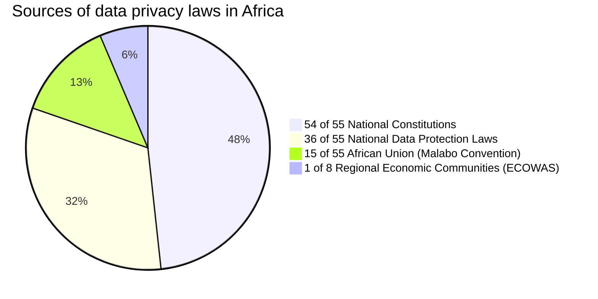

## Introduction

There are 55 countries recognized by the African Union on the African Continent. These African countries are divided into five geographic regions and eight regional economic communities show in the table below:
  
**Geographic regions** 

| Region | Countries |
|---|---|
| Central Africa | Burundi, Cameroon, Central African Republic, Chad, Republic of the Congo, DR Congo, Equatorial Guinea, Gabon, São Tomé and Príncipe |
| Eastern Africa | Comoros, Djibouti, Eritrea, Ethiopia, Kenya, Madagascar, Mauritius, Rwanda, Seychelles, Somalia, South Sudan, Sudan, Tanzania, Uganda |
| Northern Africa | Algeria, Egypt, Libya, Mauritania, Morocco, Sahrawi Republic, Tunisia |
| Southern Africa | Angola, Botswana, Eswatini, Lesotho, Malawi, Mozambique, Namibia,  South Africa, Zambia, Zimbabwe |
| Western Africa | Benin, Burkina Faso, Cape Verde, Côte d’Ivoire, Gambia, Ghana, Guinea, Guinea-Bissau, Liberia, Mali, Niger, Nigeria, Senegal, Sierra Leone, Togo |  
  
**Economic communities**

| Regional Economic Community | Countries |
| --- | --- |
| Arab Maghreb Union (AMU) | Algeria, Libya, Mauritania, Morocco, Tunisia |
| Common Market for Eastern and Southern Africa (COMESA) | Burundi, Comoros, Democratic Republic of the Congo, Djibouti, Egypt, Eritrea, Eswatini, Ethiopia, Kenya, Libya, Madagascar, Malawi, Mauritius, Rwanda, Seychelles, Somalia, Sudan, Uganda, Zambia, Zimbabwe |
| Community of Sahel-Saharan States (CEN-SAD) | Benin, Burkina Faso, Cabo Verde, Central African Republic, Chad, Comoros, Côte d’Ivoire, Djibouti, Egypt, Eritrea, Gambia, Ghana, Guinea, Guinea-Bissau, Kenya, Liberia, Libya, Mali, Mauritania, Morocco, Niger, Nigeria, São Tomé and Príncipe, Senegal, Sierra Leone, Somalia, Sudan, Togo, Tunisia |
| East African Community (EAC) | Burundi, Kenya, Rwanda, South Sudan, Tanzania, Uganda |
| Economic Community of Central African States (ECCAS) | Angola, Burundi, Cameroon, Central African Republic, Chad, Congo, Democratic Republic of the Congo, Equatorial Guinea, Gabon, Rwanda, São Tomé and Príncipe |
| Economic Community of West African States (ECOWAS) | Benin, Burkina Faso, Cape Verde, Côte d’Ivoire, Gambia, Ghana, Guinea, Guinea-Bissau, Liberia, Mali, Niger, Nigeria, Senegal, Sierra Leone, Togo |
| Intergovernmental Authority on Development (IGAD) | Djibouti, Eritrea, Ethiopia, Kenya, Somalia, South Sudan, Sudan, Uganda |
| Southern African Development Community (SADC) | Angola, Botswana, Comoros, Democratic Republic of the Congo, Eswatini, Lesotho, Madagascar, Malawi, Mauritius, Mozambique, Namibia, Seychelles, South Africa, Tanzania, Zambia, Zimbabwe |


Please note that some countries are members of multiple communities.


**Sources of Data Protection Laws in Africa**


| Source | Number of Countries |
|---|---|
| National Constitutions | 54 |
| National Data Protection Laws | 36 |
| African Union (Malabo Convention) | 15 |
| Regional Economic Communities | 1 |


**By Constitution Provision**


| Country | Constitution Provision |
| --- | --- |
| Angola | Article 32 |
| Algeria | Article 47 |
| Benin | Article 21 |
| Botswana | Articles 3 and 9 |
| Burkina Faso | 1991 Constitution |
| Burundi | Articles 28 and 42 |
| Cameroon | Preamble |
| Cabo Verde | Constitutional right of habeas data |
| Central African Republic (CAR) | Article 16 |
| Chad | Articles 17 and 49 |
| Comoros | Article 27 |
| Côte d'Ivoire | Article 8 |
| Democratic Republic of the Congo (DRC) | Article 31 |
| Djibouti | Article 13 |
| Egypt | Constitution protects privacy |
| Equatorial Guinea | Article 13 |
| Eritrea | Article 18 |
| Eswatini | Article 14 |
| Ethiopia | Article 26 |
| Gabon | Articles 1 and 47 |
| Gambia | Article 23 |
| Ghana | Article 18(2) |
| Guinea | Article 12 |
| Guinea-Bissau | Articles 34A and 38 |
| Kenya | Article 31 |
| Lesotho | Articles 4 and 11 |
| Liberia | Article 16 |
| Libya | Article 12 and 13 |
| Madagascar | 2010 Constitution |
| Malawi | Section 21 |
| Mali | Constitution protects privacy |
| Mauritania | Article 13 |
| Mauritius | Article 9 |
| Mozambique | Constitution protects privacy |
| Morocco | Article 24 |
| Namibia | Article 13 |
| Niger | Articles 27 and 29 |
| Nigeria | Section 37 |
| Republic of Congo | Article 26 |
| Rwanda | Article 23 |
| São Tomé and Príncipe | Article 24 and 25 |
| Senegal | Article 13 |
| Seychelles | Article 20 |
| Sierra Leone | Article 22 |
| Somalia | Article 19 |
| South Africa | Constitution protects privacy |
| South Sudan | Article 22 and 32 |
| Sudan | Section 55 |
| Tanzania | Article 16 |
| Togo | Article 28 |
| Tunisia | Article 24 |
| Uganda | Article 27 |
| Zambia | Article 17 |
| Zimbabwe | Article 57 |
| Sahrawi Arab Democratic Republic | No explicit provision |


Pie Charts



It was popularised in the 1960s with the release of Letraset sheets containing
Lorem Ipsum passages, and more recently with desktop publishing software like
Aldus PageMaker including versions of Lorem Ipsum.


Lorem Ipsum is simply dummy text of the printing and typesetting industry. Lorem
Ipsum has been the industry's standard dummy text ever since the 1500s, when an
unknown printer took a galley of type and scrambled it to make a type specimen
book. It has survived not only five centuries, but also the leap into electronic
typesetting, remaining essentially unchanged. It was popularised in the 1960s
with the release of Letraset sheets containing Lorem Ipsum passages, and more
recently with desktop publishing software like Aldus PageMaker including
versions of Lorem Ipsum.

## Usage

```js
import blog from "https://deno.land/x/blog/blog.tsx";

blog({
  author: "Dino",
  title: "My Blog",
  description: "The blog description.",
  avatar: "https://deno-avatar.deno.dev/avatar/blog.svg",
  avatarClass: "rounded-full",
  links: [
    { title: "Email", url: "mailto:bot@deno.com" },
    { title: "GitHub", url: "https://github.com/denobot" },
    { title: "Twitter", url: "https://twitter.com/denobot" },
  ],
});
```

$100, $200, $300, $400, $500


