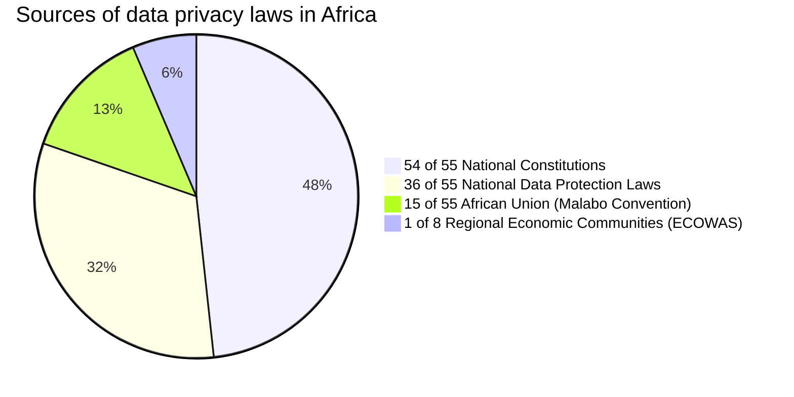

# Introduction
Africa’s $180 billion Internet economy future

Growing urban, mobile population Expanding tech ecosystem. 1.3 billion people in 2019 and 2.5 billion in 2050. E-commerce and fntech are key sections driving the digital economy. Tech talent 700k developers in 2019. Pro-innovator regulation
Including starup acts and regional harmonization, such as the African Continental Free Trade Area (AfCFTA). 

Tech talent in Africa is at a historical peak and continues to rise annually. There are 690,000 professional developers across Africa with more than 50% concentrated in 5 key African countries: Egypt, Kenya, Morocco, Nigeria, and South Africa. While there are challenges confronting starups in the African ecosystem, there remains an abundance of opporunities and increased venture capital infow to the continent. Infrastructure drives increased access to more afordable and higher-speed Internet. Tech companies’ investment in subsea andterrestrial fber-optic infrastructure has led to rapid growth in international Internet capacity. Google’s own submarine cable, Equiano, isexpected to be completed in 2022.Regulatory inconsistency can hamper market access and limit investment opporunities for starups. Starup acts and regional harmonization are initiatives that are driving mutually benefcial growth. It is imporant for entrepreneurs, investors, and policy makers to continue dialogue, encouraging environments where digital businesses can thrive. Gross domestic product (GDP) grew by 4% per year between 2010 and 2019, more than twice that of the EU-28 (1.7%) and Latin America (1.7%) over the same period. Starups building solutions to suppor the population that is fnancially excluded but gaining access to mobile technology. Fintech starups remain the top destination for funding, receiving 54% of all starup investment in 2019. e-Commerce: Growth driven by improvement payments landscape, rise in mobile tech, and mobile money tech adoption. In 2019, $134 million in funding was atributed to e-Commerce, indicating both an increase in funding and number of deals. Companies in the Internet economy have generally outperormed other sectors of the economy. 87% population growth in Africa between 2020 and 2050. Tech talent is young and growing fast, with690,000 professional developers across Africa today. Digital infrastructure is the backbone of the Internet economy around the globe and Africa. International Internet bandwidth has increased by a factor of 10 over the past decade, to 12 terabits per second (Tbps).

The frst phase of Google’s new submarine cable, Equiano, is expected to be completed in 2022, connecting Porugal and South Africa. The cable is expected to have 20x the capacity of the last cable built to serve the region, allowing for more latency-sensitive products to function and be developed. Regulatory inconsistency can complicate or impede market access and limit investment opporunities for starups, impacting starup viability and investment decisions.
Starups in many Africa countries must navigate complex regulatory environments with multiple regulators and agencies. As businesses move and grow into new countries and new markets, they need to scan each regulatory framework separately.
Given the technology-related regulatory challenges governments are facing, it is imporant for entrepreneurs, investors, and policymakers to continue dialogue, encouraging environments where digital starups and businesses can thrive

AfCFTA has the potential to unite a market of 1.3 billion people and a combined GDP of $2.6 trillion. The AfCFTA aims to reduce tarifs on 90% of all goods and facilitate free movement of goods, services, capital,
and people. It will enable Africa’s regional economic communities to become more integrated and easier to access, including the ability for starups to scale across Africa seamlessly.

Regional harmonization, and infrequent regulatory changes, are key to starup success. The African Continental Free Trade Area (AfCFTA) agreement is one major milestone toward harmonization for digital businesses.  By 2025, the Internet economy has the potential to contribute $180 billion to Africa’s economy, helping improve productivity in areas ranging from agriculture, health care, and financial services to education and supply chains. Since 2000, the number of people with access to the Internet has grown to over 520 million, or almost 40% of the population. Sixty percent of Africa’s Internet population accesses the Internet through mobile phones, and an increase of 10% in mobile Internet penetration can have a direct impact to the GDP per capita by 2.5%, compared to 2% globally. This kind of growth is both crucial and self-perpetuating — promoting increased internet access, which fuels economic growth, which fuels more transformation and so on. y. Increasing Internet penetration to 75% has the potential to create 44 million new jobs.  [1]


The African continent consists of 55 countries recognized by the African Union (AU). These countries are divided into five geographic regions and eight regional economic communities. 

The global landscape of data protection and privacy has undergone substantial changes, with the introduction of the European Union's General Data Protection Regulation (GDPR) in 2016 [2]. These regulatory developments have likely influenced the growing interest in data governance and the need for comprehensive data protection frameworks throughout Africa. The significance of GDPR is potentially more far-reaching than in other regions, due in part to the gaps in some countries’ current governance of data protection: either data protection laws that were established several years ago must be updated to align with data protection laws in other economies, or no data protection laws exist at all. Such gaps, however, have given countries opportunities to leapfrog into establishing more robust data protection structures by benefiting from the trial-and-error of previous decades while other countries were establishing data protection laws within a shifting digital landscape. Despite the policy gaps, African countries have shown significant interest in establishing data protection and data privacy laws, both in comments by policymakers and draft legislation in several AU countries. Other countries are amending existing data protection policies or working to establish structures to enforce existing laws and regulations.

This interest in creating data protection laws for a 21st-century digital landscape extends far beyond the African Union, to countries as diverse as Japan, Israel, Canada, Brazil, and India. While many African countries have adopted rules governing a generalized right to privacy, the adoption of laws specifically focused on the protection of personal data has been relatively slow. Before 2016, only 16 out of the 55 nations had enacted specific data protection laws. However, as of May 2023, the number of countries with such laws has risen significantly to 36.

The current state of data privacy law in Africa is characterized by complexity and fragmentation. There is no unified, comprehensive data privacy law that applies uniformly to all 55 AU member states. Instead, a multitude of laws and regulations exist, varying in scope, enforcement mechanisms, and effectiveness. African nations’ rules governing the protection and privacy of personal data are a patchwork, with some countries offering little to no protection policy while others have extensive digital governance frameworks. This fragmentation poses challenges for businesses in understanding their obligations regarding data privacy when doing business across Africa. Many laws are written in Arabic, English, French, Portuguese, and Spanish.

Cabo Verde is the first African country to have enacted comprehensive data protection legislation in 2001 when they passed Law No. 133-V-2001. It closely mirrored European data protection laws at the time, as Cabo Verde’s legal system largely draws from that of Portugal. The Seychellois Data Protection Act 2003 (DPA) is based on the 1984 UK Data Protection Act. The creation of Africa’s first Data Protection Authority (DPA) was in Burkina Faso in 2007. However, the first Data Protection Authority (DPA) in Africa was established by Burkina Faso in 2007 since Cape Verdean Act merely provided for a DPA but the same was not physically set up until 2015 when its first set of privacy commissioners were appointed. In African countries, experience has shown that while passage of data protection laws is one thing, commencement date is another and ultimately, their enforcement is the most difficult part of the work


This paper explores these recent trends in the establishment of data protection and privacy laws in Africa. It will begin with an overview of the sources of data protection and privacy laws in Africa. It continues with a survey and analysis of all African nations and their respective data protection policy status, noting the countries that have adopted data protection laws, those that have not, and those that have adopted data protection policies since the adoption of GDPR in 2016, and those with GDPR-like, EU-like, UK-like Data Privacy Laws. This section also includes case studies of the data protection laws of Congo Republic, Rwanda, Mauritania, Zambia, and Nigeria. The touch on an exploration of the possible implications of this patchwork of data protection and privacy laws, noting the multitude of laws and regulations exist, varying in scope, enforcement mechanisms, and effectiveness. The paper concludes with the need for Harmonisation of data privacy laws in Africa, and proposal of a tool for automating data privacy compliance, offering a practical solution for data protection authorities, businesses, developers, and data protection officers in Africa.

## Sources of Data Protection Laws in Africa

1. **Constitutional Gurantee of Privacy:** 54 of the 55 African countries have established a generalized right to privacy in their constitutions. The Sahrawi Constitution is the only on the continent that does not explicitly protect the right to privacy.

2. **National data protection laws:** 36 African countries have enacted specific data protection laws to address the growing need for safeguarding personal data. These laws vary in their scope, content, and effectiveness, reflecting the unique regulatory approaches adopted by each country.

3. **Continental, Sectoral, and Regional Initiatives:** 
 - *African Union Convention on Cyber Security and Personal Data Protection (The Malabo Convention 2014)*, adopted by the AU Assembly in 2014, aims to establish a comprehensive legal framework for electronic commerce, data protection, cybercrime, and cybersecurity across the African continent. As of May 2023, 15 countries have ratified the Malabo Convention, and 19 countries have signed the Malabo Convention without ratifying it. The Convention will come into
force 30 days after the 15th ratification and deposit.
 - *Economic Community of West African States (ECOWAS) Supplementary Act A/SA. 1/01/10 on Personal Data Protection (The ECOWAS Supplementary Act 2010)*, enacted by the ECOWAS, provides guidelines for data protection within its 15 member states. Drawing inspiration from the European Union's Council of Europe’s Convention 108 and the EU General Data Protection Regulation predecessor, the EU Data Directive, this act emphasizes key principles for processing personal data, with consent as the primary legal basis.
 - The Central African Economic and Monetary Community (CEMAC) has also issued some legislation which is applicable. Notably, Regulation No. 01/20/CEMAC/UMAC/COBAC of 3 July 2020 on the Protection of Consumers of Banking Products and Services in CEMAC provides in article 30 for the right to erasure by allowing for a person to access information that is collected on them and to request its erasure.
 - Regulation No. 21/08-UEAC-13-CM-18 of 19 December 2008 on the Harmonisation of Regulations and Regulatory Policies on Electronic Communications in CEMAC Member States;
 - Directive No. 07/08-UEAC-133-CM-18 of 19 December 2008 on the Legal Framework for the Protection of Users of Electronic Communications Networks and Services within CEMAC;
 - Directive No. 09/08-UEAC-133-CM-18 of 19 December 2008 Harmonising the Legal Frameworks of Electronic Communications in the CEMAC Member States;
 - Regulation No. 03/16-CEMAC-UMAC-CMAC-CM of 21 December 2016 on Systems, Means and Incidents of Payment;
 - Directive No. 02/19-UEAC-639-CM-18 of 08 April 2019 Harmonising the Protection of Consumers within CEMAC; and
 - Regulation No. 01/20/CEMAC/UMAC/COBAC of 03 July 2020 on the Protection of Consumers of Banking Products and Services in CEMAC.
 - Southern African Development Community (SADC) Model Law
 -  East Africa Community Framework for Cyber laws (2008): The Framework for Cyberlaws (“Framework”) was prepared by the East African Community EAC Task Force on Cyberlaws, comprising representatives from the
Partner States and the EAC Secretariat, with the support of UNCTAD. The Framework contains a series of Recommendations made to the governments of the Partner States about reforming national laws to facilitate electronic commerce; to facilitate the use of data security mechanisms; to deter conduct designed to undermine the confidentiality, integrity and availability of information and communication technologies; to protect consumers in an online environment, and to protect individual privacy. The Recommendations are designed to harmonise the law reform process between the EAC Partner States, as well as reflecting international best practice.
 

The Need for Harmonization
Harmonization of data privacy laws is a pressing need in Africa. Aligning regulations and practices would ensure clarity and consistency, facilitating better compliance for businesses and enhancing the protection of individuals' privacy rights. Efforts toward harmonization would create a unified framework where businesses and individuals can navigate data privacy laws with ease. Although the African Union Convention on Cyber Security and Personal Data Protection (The Malabo Convention 2014 can be a useful starting point to harmonisation, it has been argued that the data protection framework it provides may have outlived its usefulness as bridge for collaboration (especially with Europe) because it was predominantly modelled after the EU Data Protection Directive 95/46/EC that has now been repealed and replaced by the General Data Protection regulations (GDPR). Nevertheless, the Malabo Convention does provide a personal data protection framework which African countries may potentially transpose into their national legislation and encourages African countries to recognise the need for protecting personal data and promoting the free flow of such personal data, taking global digitalisation and trade into account. The Convention and guidelines are strategic frameworks for harmonisation which is essential to facilitate cross-border data transfers within Africa as well as that with the rest of the world.
A harmonised data protection environment is critical for the socio-economic development in the fourth industrial revolution. The ability to move seamlessly and transfer such data including personal data will influence growth and development.
As of May 2023, 36 African countries have data protection laws and/or regulationsy, 34 out of which have data protection authorities. Of the countries that have data protection laws there are significant differences in their structures and approaches to implementation. These differences in the various country laws have been influenced by their legal, political, economic and cultural differences. Data protection and privacy continue to face many changes in Africa some of which stem from the lack of resources (human and financial) to build the necessary capacity to develop the data protection/privacy ecosystem. Most data protection authorities in Africa are poorly resourced and therefore lack the ability to attract
the high-calibre staff needed to drive their agenda. The lack of resources also weakens regulators’ enforcement capabilities.

Data protection and privacy expertise on the African continent is also sparse. There are few experts that are sparsely scattered, minimising their impact in the environment. An efficient data protection ecosystem can only
be driven in a well-informed environment. Unfortunately for Africa, little has been done in the way of awareness creation and capacity building to support this developing industry. This challenge has also fuelled the general
lack of knowledge and understanding on issues of data protection and privacy. Due the unconsolidated nature of the laws across Africa, there are also challenges around the cross-border data transfers within Africa as well as between Africa and the rest of the world. The existing laws on cross-border transfers are varied, with countries that have restrictions on transfers and others that do not. These restrictions usually come by way of prior authorisations/approvals and data residency/localisation laws. With predominantly limited financial resource and staff constraints as well as existing bureaucratic systems the prior authorisations/ approvals are expensive and have been known not only to burden the authorities but also discourage growth and innovation. These challenges are not insurmountable but can be addressed by painstakingly working out frameworks for harmonisation, issuing guidance, cooperation and collaboration as well as exploring mechanisms to improve crossborder data flows. As an emerging economic region, Africa is growing at a rapid pace, it is therefore important to create an environment that facilitates the effective conduct of business within Africa and with other international markets. While the need to understand the African data protection/privacy regulatory landscape is key, efforts to address the challenges identified will be crucial for sustained socio-economic development in Africa

As with every ecosystem, the data protection laws’ observance and enforcement cycle in Africa is incomplete without the role played by the regulators that are assigned the responsibility of
informing the stakeholders of their rights and obligations under the relevant laws on one hand, and ensuring compliance with the respective laws on the other. In many countries across the world, DPAs’ investigative activities and attendant decisions are not shrouded in secrecy as the reports are publicly available and accessible. However, this cannot be said of DPAs in African countries, as most of them have made information about their activities elusive. Due to lack of independence and other factors, the prevailing perception is that DPAs in African countries do not stamp their anticipated authorities like their counterparts in Europe, for example. With the exception of a very few countries, DPAs in Africa are seen to have been technically subdued by their appointors or silenced by their innate infrastructural inhibitions, with the attendant effect of stunted growth of data protection laws and enforcement on the continent.


## African Countries with Data Protection Laws


| Country    | Region  | Constitutional Provision for Privacy Law | National Data Protection Law | Year of Enactment | Data Protection Law Name             | Ratification Status of AU Privacy Law | Data Protection Authority Appointed |
|------------|---------|----------------------------------------|------------------------------|--------------------|--------------------------------------|-------------------------------------|-------------------------------------|
| Algeria | Northern Africa | Article 47 | Yes | June 10, 2018 | Law No. 18-07 | - | Yes |
| Angola | Southern Africa | Article 32 | Yes | June 17, 2011 | Data Protection Law (Law No. 22/11) | Ratified (11 May 2020) | Yes |
| Benin | Western Africa | Article 21 | Yes | 2017 | Law No. 2009-09 and Book V of the 2017 Digital Code of the Republic of Benin | Signed | Yes |
| Botswana | Southern Africa | Articles 3 and 9 | Yes | August 3, 2018 | Data Protection Act 2018 | - | Yes |
| Burkina Faso | Western Africa | 1991 Constitution | Yes | 2004 | Law N°010- 2004/AN and Law No. 001-2021 | - | Yes |
| Burundi | Eastern Africa | Articles 28 and 42 | No | - | - | - | - |
| Cameroon | Central Africa | Preamble | No | -| - | Signed | Yes |
| Cape Verde | Western Africa | Constitutional right of habeas data | Yes | January 22, 2001| Law No. 133-V-2001 and Law No. 41 and 42 2013  | Ratified (5 February 2022) | Yes |
| Central African Republic (CAR) | Central Africa | Article 16 | No | - | - | - | No |
| Chad | Central Africa | Articles 17 and 49 | Yes | February 10, 2015 |  Law No. 007/PR/2015 and Law No. 006/PR/2015 | Signed | Yes |
| Comoros | Eastern Africa | Article 27 | No | - | - | Signed | - |
| Côte d'Ivoire | Western Africa | Article 8 | Yes | June 19, 2013 | Law No. 2013-450 | Ratified (3 April 2023) | Yes | 
| Congo | Central Africa | Article 26 | Yes | 2019 |  Law No. 29-2019  | Ratified (23 October 2020)  | Yes | - |
| Djibouti | Eastern Africa | Article 13 | No | - | - | Signed | No | 
| Democratic Republic of Congo | Central Africa | Article 31 | No | - | - | - |
| Egypt | Northern Africa | Constitution protects privacy | Yes | October 15, 2020 | Resolution No. 151 of 2020 | - | No | 
| Equatorial Guinea | Central Africa | Article 13 | No | - | - | - |
| Eritrea | Eastern Africa | Article 18 | No | - | - | - |
| Eswatini | Southern Africa | Article 14 | No | - | - | - |
| Ethiopia | Eastern Africa | Article 26 | Yes | 2019 | Proclamation No. 1170/2019 on the Protection of Personal Data | Signed |
| Gabon | Central Africa | Articles 1 and 47 | Yes | 2019 | Law No. 025/2019 on the Protection of Personal Data | Ratified |
| Gambia | Western Africa | Article 23 | Yes | 2013 | Data Protection Act, 2013 | Signed |
| Ghana | Western Africa | Article 18(2) | Yes | 2012 | Data Protection Act, 2012 (Act 843) | Ratified (3 June 2019) |
| Guinea | Western Africa | Article 12 | Yes | 2021 | Law No. 2011/002 on the Protection of Personal Data | Ratified (16 October 2018) |
| Guinea-Bissau | Western Africa | Articles 34A and 38 | No | - | - | Signed | | 
| Kenya | Eastern Africa | Article 31 | Yes | 2019 | Data Protection Act, 2019 | Signed |
| Lesotho | Southern Africa | Articles 4 and 11 | No | - | - | - |
| Liberia | Western Africa | Article 16 | Yes | 2019 | Data Protection Act, 2019 | Signed |
| Libya | Northern Africa | Articles 12 and 13 | No | - | - | - |
| Madagascar | Eastern Africa | 2010 Constitution | No | - | - | - |
| Malawi | Eastern Africa | Section 21 | Yes | 2018 | Data Protection Act, 2018 | Ratified |
| Mali | Western Africa | Constitution protects privacy | Yes | 2021 | Law No. 2018-022 on the Protection of Personal Data | Ratified |
| Mauritania | Western Africa | Article 13 | Yes | 2007 | Law No. 2007-048 on the Protection of Personal Data | Ratified  (9 May 2023) |
| Mauritius | Eastern Africa | Article 9 | Yes | 2017 | Data Protection Act 2017 | Ratified (14 March 2018) |
| Morocco | Northern Africa | Article 24 | Yes | 2009 | Law No. 09-08 on the Protection of Individuals with Regard to the Processing of Personal Data | Ratified | | 
| Mozambique | Eastern Africa | Constitution protects privacy | Yes | 2021 | Data Protection Law (Law No. 34/2021) | Ratified (21 January 2020) |  |
| Namibia | Southern Africa | Article 13 | Yes | 2013 | Protection of Personal Information Act, 2013 | Ratified (1 February 2019) |
| Niger | Western Africa | Articles 27 and 29 | Yes | 2011 | Law No. 2011-35 on the Protection of Personal Data | Ratified (16 March 2022) |
| Nigeria | Western Africa | Section 37 | Yes | 2019 | Nigeria Data Protection Regulation (NDPR) | Ratified |
| Rwanda | Eastern Africa | Article 23 | Yes | 2019 | Law No. 21/2013 on Personal Data Protection | Ratified (21 November 2019) |
| Sahrawi Arab Democratic Republic | Northern Africa | No explicit provision | No | - | - | - |
| São Tomé and Príncipe | Western Africa | Article 24 and 25 | Yes | 2018 | Personal Data Protection Law (Law No. 6/2018) | Signed | | 
| Senegal | Western Africa | Article 13 | Yes | 2008 | Law No. 2008-12 on the Protection of Personal Data | Ratified (16 August 2016) |
| Seychelles | Eastern Africa | Article 20 | Yes | 2003 | Data Protection Act, 2003 | Ratified |
| Sierra Leone | Western Africa | Article 22 | Yes | 2019 | Data Protection Act, 2019 | Signed |
| Somalia | Eastern Africa | Article 19 | No | - | - | - |
| South Africa | Southern Africa | Section 14 | Yes | 2013 | Protection of Personal Information Act, 2013 (POPIA) | Signed |
| South Sudan | Eastern Africa | Article 22 and 32 | No | - | - | - |
| Sudan | Northern Africa | Section 55 | No | - | - | Signed | | 
| Tanzania | Eastern Africa | Article 16 | Yes | 2019 | The Data Protection Act, 2019 | Signed |
| Togo | Western Africa | Article 28 | Yes | 2019 | Law No. 2009-013 on the Protection of Personal Data | Ratified (19 October 2021) |
| Tunisia | Northern Africa | Article 24 | Yes | 2004 | Organic Law No. 2004-63 on the Protection of Personal Data | Signed | | 
| Uganda | Eastern Africa | Article 27 | Yes | February 25, 2019 | Data Protection and Privacy Act, 2019 | - | | 
| Zambia | Eastern Africa | Article 17 | Yes | March 24, 2021 | Data Protection Act, 2016 | Ratified (24 March 2021) | |
| Zimbabwe | Southern Africa | Article 57 | Yes | December 7, 2021 | Data Protection Act, 2019 | - |


In 2016, the European Union (EU) promulgated EU Regulation 2017/679. Also known as the EU General Data Protection Regulation (GDPR), this regulation reshaped the governance of personal data in the EU. It created new mechanisms for EU member states to enact fines for noncompliance with data protection principles and created EUwide boards to govern implementation and disputes among EU member states on enforcement


| Region | Countries |
|---|---|
| Central Africa | Burundi, Cameroon, Central African Republic, Chad, Republic of the Congo, DR Congo, Equatorial Guinea, Gabon, São Tomé and Príncipe |
| Eastern Africa | Comoros, Djibouti, Eritrea, Ethiopia, Kenya, Madagascar, Mauritius, Rwanda, Seychelles, Somalia, South Sudan, Sudan, Tanzania, Uganda |
| Northern Africa | Algeria, Egypt, Libya, Mauritania, Morocco, Sahrawi Republic, Tunisia |
| Southern Africa | Angola, Botswana, Eswatini, Lesotho, Malawi, Mozambique, Namibia,  South Africa, Zambia, Zimbabwe |
| Western Africa | Benin, Burkina Faso, Cape Verde, Côte d’Ivoire, Gambia, Ghana, Guinea, Guinea-Bissau, Liberia, Mali, Niger, Nigeria, Senegal, Sierra Leone, Togo |  
  
**Economic communities**

| Regional Economic Community | Countries |
| --- | --- |
| Arab Maghreb Union (AMU) | Algeria, Libya, Mauritania, Morocco, Tunisia |
| Common Market for Eastern and Southern Africa (COMESA) | Burundi, Comoros, Democratic Republic of the Congo, Djibouti, Egypt, Eritrea, Eswatini, Ethiopia, Kenya, Libya, Madagascar, Malawi, Mauritius, Rwanda, Seychelles, Somalia, Sudan, Uganda, Zambia, Zimbabwe |
| Community of Sahel-Saharan States (CEN-SAD) | Benin, Burkina Faso, Cabo Verde, Central African Republic, Chad, Comoros, Côte d’Ivoire, Djibouti, Egypt, Eritrea, Gambia, Ghana, Guinea, Guinea-Bissau, Kenya, Liberia, Libya, Mali, Mauritania, Morocco, Niger, Nigeria, São Tomé and Príncipe, Senegal, Sierra Leone, Somalia, Sudan, Togo, Tunisia |
| East African Community (EAC) | Burundi, Kenya, Rwanda, South Sudan, Tanzania, Uganda |
| Economic Community of Central African States (ECCAS) | Angola, Burundi, Cameroon, Central African Republic, Chad, Congo, Democratic Republic of the Congo, Equatorial Guinea, Gabon, Rwanda, São Tomé and Príncipe |
| Economic Community of West African States (ECOWAS) | Benin, Burkina Faso, Cape Verde, Côte d’Ivoire, Gambia, Ghana, Guinea, Guinea-Bissau, Liberia, Mali, Niger, Nigeria, Senegal, Sierra Leone, Togo |
| Intergovernmental Authority on Development (IGAD) | Djibouti, Eritrea, Ethiopia, Kenya, Somalia, South Sudan, Sudan, Uganda |
| Southern African Development Community (SADC) | Angola, Botswana, Comoros, Democratic Republic of the Congo, Eswatini, Lesotho, Madagascar, Malawi, Mauritius, Mozambique, Namibia, Seychelles, South Africa, Tanzania, Zambia, Zimbabwe |


Please note that some countries are members of multiple communities.


**Sources of Data Protection Laws in Africa**


| Source | Number of Countries |
|---|---|
| National Constitutions | 54 |
| National Data Protection Laws | 36 |
| African Union (Malabo Convention) | 15 |
| Regional Economic Communities | 1 |


**By National Constitution Provision**


| Country | Constitution Provision |
| --- | --- |
| Angola | Article 32 |
| Algeria | Article 47 |
| Benin | Article 21 |
| Botswana | Articles 3 and 9 |
| Burkina Faso | 1991 Constitution |
| Burundi | Articles 28 and 42 |
| Cameroon | Preamble |
| Cabo Verde | Constitutional right of habeas data |
| Central African Republic (CAR) | Article 16 |
| Chad | Articles 17 and 49 |
| Comoros | Article 27 |
| Côte d'Ivoire | Article 8 |
| Democratic Republic of the Congo (DRC) | Article 31 |
| Djibouti | Article 13 |
| Egypt | Constitution protects privacy |
| Equatorial Guinea | Article 13 |
| Eritrea | Article 18 |
| Eswatini | Article 14 |
| Ethiopia | Article 26 |
| Gabon | Articles 1 and 47 |
| Gambia | Article 23 |
| Ghana | Article 18(2) |
| Guinea | Article 12 |
| Guinea-Bissau | Articles 34A and 38 |
| Kenya | Article 31 |
| Lesotho | Articles 4 and 11 |
| Liberia | Article 16 |
| Libya | Article 12 and 13 |
| Madagascar | 2010 Constitution |
| Malawi | Section 21 |
| Mali | Constitution protects privacy |
| Mauritania | Article 13 |
| Mauritius | Article 9 |
| Mozambique | Constitution protects privacy |
| Morocco | Article 24 |
| Namibia | Article 13 |
| Niger | Articles 27 and 29 |
| Nigeria | Section 37 |
| Republic of Congo | Article 26 |
| Rwanda | Article 23 |
| São Tomé and Príncipe | Article 24 and 25 |
| Senegal | Article 13 |
| Seychelles | Article 20 |
| Sierra Leone | Article 22 |
| Somalia | Article 19 |
| South Africa | Section 14  |
| South Sudan | Article 22 and 32 |
| Sudan | Section 55 |
| Tanzania | Article 16 |
| Togo | Article 28 |
| Tunisia | Article 24 |
| Uganda | Article 27 |
| Zambia | Article 17 |
| Zimbabwe | Article 57 |
| Sahrawi Arab Democratic Republic | No explicit provision |


| Country | Constitution Provision | Data Protection Law | Year of Ratification | Year of Enactment |
| --- | --- | --- | --- | --- |
| Angola | Article 32 | Yes | 2020 | 2011 |
| Algeria | Article 47 | Yes | - | - |
| Benin | Article 21 | Yes | - | 2017 |
| Botswana | Articles 3 and 9 | No | - | - |
| Burkina Faso | 1991 Constitution | Yes | - | 2004 |
| Burundi | Articles 28 and 42 | No | - | - |
| Cameroon | Preamble | No | - | - |
| Cabo Verde | Constitutional right of habeas data | Yes | - | 2001 |
| Central African Republic (CAR) | Article 16 | No | - | - |
| Chad | Articles 17 and 49 | Yes | - | - |
| Comoros | Article 27 | No | - | - |
| Côte d'Ivoire | Article 8 | Yes | - | 2013 |
| Democratic Republic of the Congo (DRC) | Article 31 | No | - | - |
| Djibouti | Article 13 | No | - | - |
| Egypt | Constitution protects privacy | Yes | - | 2020 |
| Equatorial Guinea | Article 13 | Yes | - | - |
| Eritrea | Article 18 | No | - | - |
| Eswatini | Article 14 | No | - | - |
| Ethiopia | Article 26 | Yes | - | - |
| Gabon | Articles 1 and 47 | Yes | - | 2011 |
| Gambia | Article 23 | No | - | - |
| Ghana | Article 18(2) | Yes | 2016 | 2012 |
| Guinea | Article 12 | No | - | - |
| Guinea-Bissau | Articles 34A and 38 | No | - | - |
| Kenya | Article 31 | Yes | 2016 | 2019 |
| Lesotho | Articles 4 and 11 | Yes | - | 2011 |
| Liberia | Article 16 | No | - | - |
| Libya | Article 12 and 13 | Yes | - | - |
| Madagascar | 2010 Constitution | Yes | - | - |
| Malawi | Section 21 | Yes | - | 2015 |
| Mali | Constitution protects privacy | Yes | - | - |
| Mauritania | Article 13 | Yes | 2023 | - |
| Mauritius | Article 9 | Yes | 2018 | 2017 |
| Mozambique | Constitution protects privacy | No | - | - |
| Morocco | Article 24 | Yes | - | 2009 |
| Namibia | Article 13 | Yes | - | - |
| Niger | Articles 27 and 29 | Yes | - | - |
| Nigeria | Section 37 | Yes | - | 2019 |
| Republic of Congo | Article 26 | No | - | - |
| Rwanda | Article 23 | Yes | - | 2016 |
| São Tomé and Príncipe | Article 24 and 25 | Yes | - | - |
| Senegal | Article 13 | Yes | - | 2010 |
| Seychelles | Article 20 | No | - | - |
| Sierra Leone | Article 22 | Yes


Pie Charts



It was popularised in the 1960s with the release of Letraset sheets containing
Lorem Ipsum passages, and more recently with desktop publishing software like
Aldus PageMaker including versions of Lorem Ipsum.


Lorem Ipsum is simply dummy text of the printing and typesetting industry. Lorem
Ipsum has been the industry's standard dummy text ever since the 1500s, when an
unknown printer took a galley of type and scrambled it to make a type specimen
book. It has survived not only five centuries, but also the leap into electronic
typesetting, remaining essentially unchanged. It was popularised in the 1960s
with the release of Letraset sheets containing Lorem Ipsum passages, and more
recently with desktop publishing software like Aldus PageMaker including
versions of Lorem Ipsum.

## Usage

```js
import blog from "https://deno.land/x/blog/blog.tsx";

blog({
  author: "Dino",
  title: "My Blog",
  description: "The blog description.",
  avatar: "https://deno-avatar.deno.dev/avatar/blog.svg",
  avatarClass: "rounded-full",
  links: [
    { title: "Email", url: "mailto:bot@deno.com" },
    { title: "GitHub", url: "https://github.com/denobot" },
    { title: "Twitter", url: "https://twitter.com/denobot" },
  ],
});
```

$100, $200, $300, $400, $500


