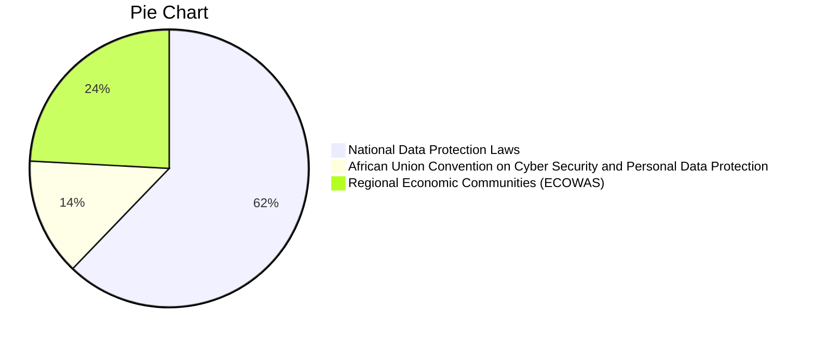

Pie Charts



It was popularised in the 1960s with the release of Letraset sheets containing
Lorem Ipsum passages, and more recently with desktop publishing software like
Aldus PageMaker including versions of Lorem Ipsum.


Lorem Ipsum is simply dummy text of the printing and typesetting industry. Lorem
Ipsum has been the industry's standard dummy text ever since the 1500s, when an
unknown printer took a galley of type and scrambled it to make a type specimen
book. It has survived not only five centuries, but also the leap into electronic
typesetting, remaining essentially unchanged. It was popularised in the 1960s
with the release of Letraset sheets containing Lorem Ipsum passages, and more
recently with desktop publishing software like Aldus PageMaker including
versions of Lorem Ipsum.

## Usage

```js
import blog from "https://deno.land/x/blog/blog.tsx";

blog({
  author: "Dino",
  title: "My Blog",
  description: "The blog description.",
  avatar: "https://deno-avatar.deno.dev/avatar/blog.svg",
  avatarClass: "rounded-full",
  links: [
    { title: "Email", url: "mailto:bot@deno.com" },
    { title: "GitHub", url: "https://github.com/denobot" },
    { title: "Twitter", url: "https://twitter.com/denobot" },
  ],
});
```

$100, $200, $300, $400, $500


