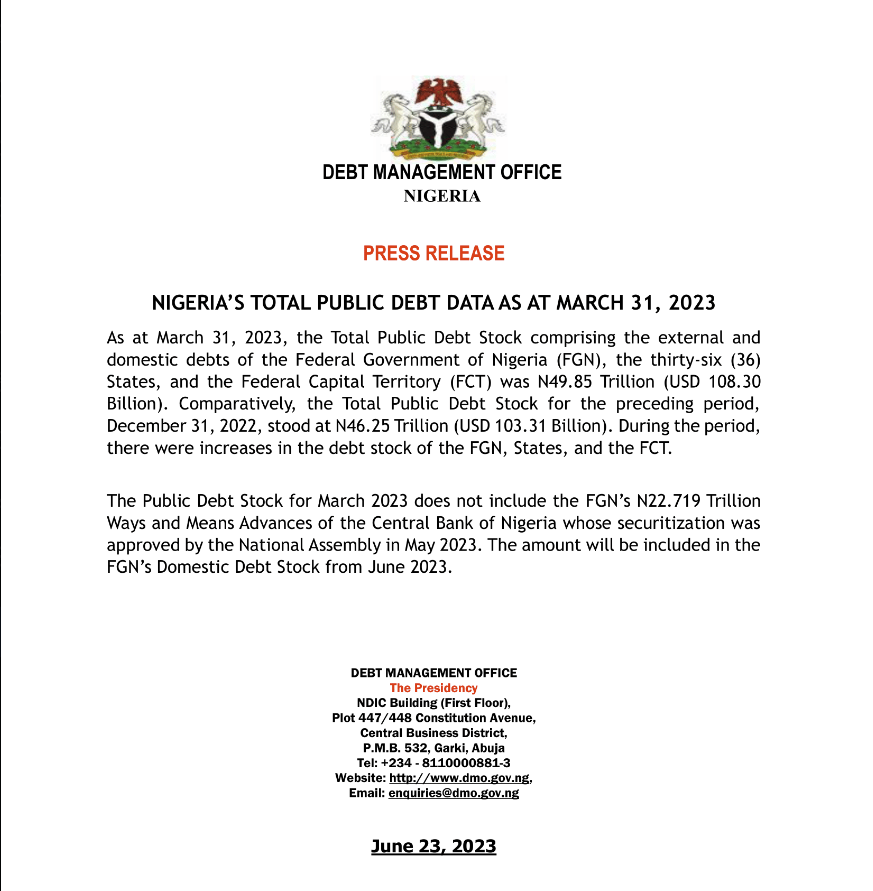
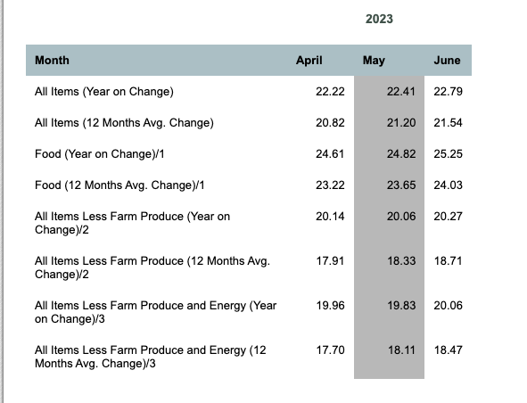
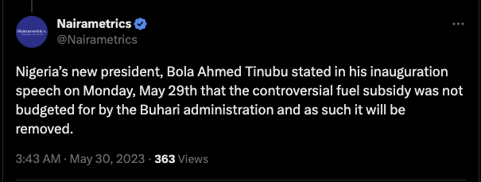
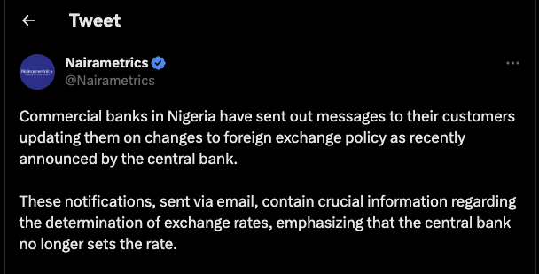
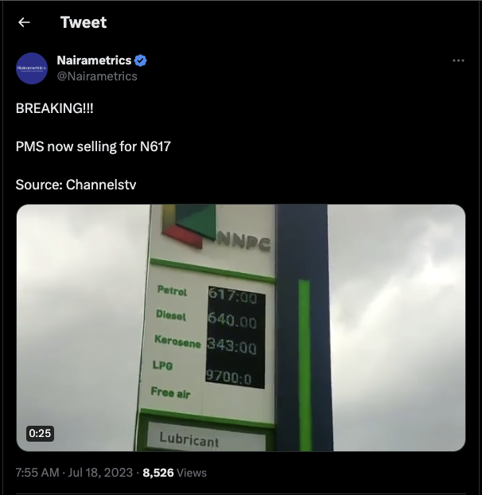
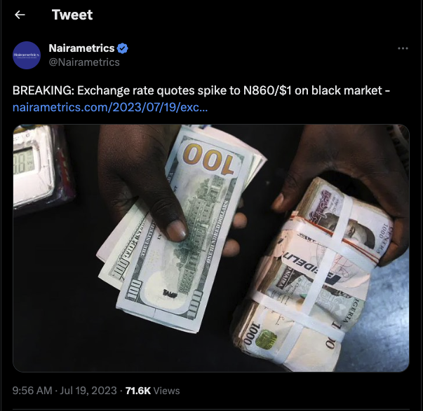

## The Winds of Change
In recent months, Nigeria has seen big policy shifts. Starting when the new president stepped into office on May 29, 2023, he introduced fresh fiscal and monetary policies, creating a new chapter in Nigeria's economic story. Key decisions included ending the fuel subsidy and the Central bank of Nigeria (CBN) granting permission for commercial banks to sell foreign currency at any rate they deem fit. The tremors from these changes are rippling through the nation, sparking both challenges and opportunities.

## A Bitter Legacy
The stage was set by the previous administration, which budgeted for the fuel subsidy only until June 30, 2023. With the country's colossal debt of ₦49.85 trillion ($108.30 billion) waiting for them, the incoming government had a tough call to make. With 96% of Nigeria's revenue spent on debt servicing, the fear of a crippling cash crunch made the decision clear: the fuel subsidy had to go. This decision sent shockwaves throughout the country, with immediate and tangible effects felt by all.
 

## The Tides of Change
The end of the fuel subsidy on July 1, 2023, alongside the new approach to the foreign exchange market, initiated on June 14, 2023, has triggered significant shifts. For the everyday Nigerian, these changes have hit hard. Prices have risen steeply - transport, food, even the cost of running generators, which are lifelines given the erratic power supply. And all of this is made worse by an inflation rate of 22.79% as of June 2023, a harsh blow to the average Nigerian trying to make ends meet.

Meanwhile, businesses are grappling with increased operational costs, decreased demand, disrupted supply chains, and investment uncertainties. The tough economic climate is intensified by fluctuating foreign exchange rates, standing at ₦806 naira to a $1 dollar, and fuel prices soaring to ₦617 per liter as of July 18, 2023.

## The Fuel Subsidy: A Retrospective
The fuel subsidy, introduced in the 1970s, was a safety net for decades. It helped shield Nigeria's 200 million citizens from the brunt of Europe's high refining costs. However, the subsidy became a costly affair, draining the government of over ₦4 trillion naira ($10bn) in 2022 alone. Despite its benefits, the subsidy was often a hotbed for corruption and opacity, as demonstrated by the 2012 National Assembly inquiry that unearthed a $6bn fraud involving NNPC officials.

In 2012, President Goodluck Jonathan's attempt to remove the subsidy sparked widespread protests, causing a national standstill. Yet, the weight of the subsidies persisted, and they were finally removed in 2023 by President Bola Tinubu.

## Rethinking the Economy
Looking at Nigeria's economic history, the naira's journey stands out. In the late '80s, one naira traded for more than a dollar. But a lot has changed since then.

In 2016, in response to an economic crisis triggered by plummeting global oil prices, Nigeria attempted a "managed float" of the naira. The Central Bank allowed the currency's value to be market-driven, but this move faced significant hurdles.

Today, with the fuel subsidy gone and the naira floated, the government no longer provides dollars to control petrol costs, and the Central Bank no longer sets exchange rates. This means a freer economic structure, with businesses and individuals dictating rates in the official foreign exchange market.

## Turning Challenges into Opportunities
In the face of these changes, I am reshaping Ovabor Development Labs Limited into a diversified holding company. I'm expanding our vision beyond just incubating and investing in tech startups. I see untapped potential in everyday Nigerian businesses across various sectors like oil and gas, restaurants, bookstores, and insurance companies, to name a few. We'll be looking for businesses that generate cash, have efficient management, and demonstrate growth potential.

This isn't just about profits; it's about building a robust Nigerian economy. If local businesses thrive, our economy thrives.

## The Road Ahead
This choice comes from my desire to see Nigeria rise above these challenges. So, if you know any Nigerian companies in these sectors that are struggling and are open to selling their businesses, please reach out to me at 36vest@ovabor.com. Together, we can weather this storm and chart a brighter future for Nigeria.
