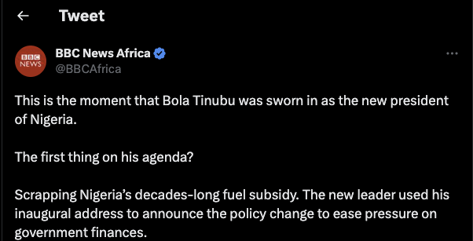

## Introduction
Over the past few months, Nigeria has been experiencing some significant policy changes, which have had profound impacts on the economy. These changes began when the new president took office on May 29, 2023. His administration implemented new fiscal and monetary policies which are altering the economic landscape of the country. From the removal of fuel subsidy to the authorization given by the Central Bank of Nigeria (CBN) for commercial banks to sell foreign exchange freely at market-determined rates. This has presented both challenges and opportunities within the economic landscape, the effects of which are rippling throughout the nation across various sectors.
  

## Setting the Stage: Economic Challenges
The backdrop to this momentous policy shift is an economic legacy left by the immediate past President, whose administration only provided budgetary allocation for petrol subsidy until June 30, 2023, leaving the incoming administration to make the final decision. The adminstration also left a staggering debt of ₦49.85 trillion ($108.30 billion) to local and foreign creditors. Consequently, 96 percent of government revenue goes towards servicing this debt, raising fears of a more severe cash crunch if subsidy payments were to continue. It is against this backdrop that the fuel subsidy removal was announced, creating a ripple of immediate and palpable effects on the populace.
 

## Fiscal and Monetary Policy Shifts: Impacts and Ramifications
The removal of the fuel subsidy, which came into effect on July 1, 2023, along with the new operational changes to the foreign exchange market, announced by the Central Bank of Nigeria (CBN) on June 14, 2023 that authorized commercial banks to sell foreign exchange freely at market-determined rates have caused significant changes in the market.
 

 

For consumers, these changes have led to a hike in the cost of goods and services, including transportation and food, and a notable rise in fuel costs for generators - an essential item due to Nigeria's unstable electricity supply. This situation is further compounded by the nation's high inflation rate of 22.79 percent (as of June 2023), which is negatively impacting consumer confidence and the cost of living. Inflation is the rate at which prices for goods and services increase, affects various facets of the economy. It impacts individual spending power and can affect the interest on the national debt. The rate at which prices change can have wide-ranging consequences across the economy. When inflation rises, the value of money erodes, and this can result in wage devaluation, increased living costs, and reduced purchasing power.

For businesses, these challenges translate to increased costs, reduced demand, stymied investments, and disruptions in supply chains. The overall economic environment is further strained by fluctuations in the foreign exchange rate, which stood at ₦806 naira to a $1 dollar, and the increase in fuel prices to ₦617 per liter as of July 18, 2023.

