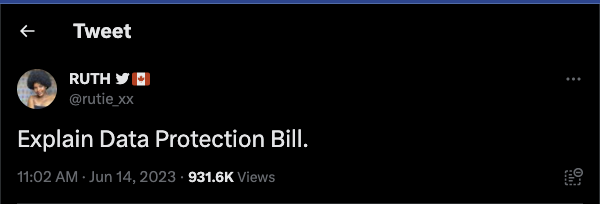

## A Brief History of Data Protection Laws in Nigeria
The road to data privacy in Nigeria has been an evolutionary process anchored by the constitutional provision for the right to privacy. Section 37 of the 1999 Constitution of the Federal Republic of Nigeria guarantees and protects the privacy of citizens, their homes, correspondence, telephone conversations, and telegraphic communications.

In 2013, the National Information Technology Development Agency (NITDA) launched the NITDA Guidelines, setting standards for the processing of personal data, including its acquisition, handling, usage, and disclosure. Despite being a considerable leap towards data protection, these guidelines still left gaps that required a more comprehensive law.

The Nigerian Data Protection Regulation (NDPR), launched by NITDA in 2019, marked the next step in strengthening data protection, aiming to safeguard the rights of Nigerian citizens while also boosting the global competitiveness of Nigerian businesses.

Despite the strides made with the NDPR, it faced criticism due to its limited efficacy and enforceability, as it was not an Act of the National Assembly. This prompted the creation of the Data Protection Bill 2022, which, on June 14, 2023, was signed into law by the President, officially becoming the Data Protection Act. This Act, being a comprehensive law, offers a binding legal framework for data protection in Nigeria.

## Unpacking the Data Protection Act: Principles, Exemptions, Applications, and More
In an era where data is no less than digital gold, protecting it becomes paramount. Recognizing this need, Nigeria's Data Protection Act was enacted, a landmark legislation set to redefine data privacy norms. Yet, amid the buzz, there's significant ambiguity about the Act's real implications for the everyday consumer.

First off, let's dispel the myths: The Act isn't about the cost of internet data or surveillance by the government. Instead, it focuses on preventing the misuse of your personal data. It introduces a stringent framework to regulate how personal data is processed, fortifying individual privacy rights in the process. The Act outlines our rights as consumers (**data subjects**), defines the responsibilities of entities that handle our data (**data controllers**), and delineates the role of the Data Protection Commission in ensuring compliance with the law.

As we embark on this deep dive into the Act, it's crucial to understand some key terms, principles, and exceptions that the Act introduces. We'll also explore the lawful basis for processing personal data, the Act's practical applications, and most importantly, the protection and rights it offers us as consumers. 

## Terminologies
Let's decode some key terminologies below:

1. **Consent:** This is your agreement to the processing of your personal data. It should be freely given, specific, informed, and unambiguous, whether expressed in writing, orally, or through an affirmative action. Essentially, it's your "yes" to the use of your personal data.

2. **Data Subject:** That's you! As the data subject, you are the individual whose personal data is being processed or considered. The Data Protection Act is designed to protect you and your personal information.

3. **Personal Data:** This is your individual information that can be used to identify you. It could be your name, an identification number like BVN, NIN, location data, or an online identifier like twiter username. It could also be related to your physical, psychological, cultural, social, or economic identity. Basically, if it's about you, it's your personal data.

4. **Sensitive Personal Data:** This is a special category of personal data that reveals critical aspects of your identity. It includes things like genetic and biometric data used for identifying you uniquely, your race or ethnic origin, religious or similar beliefs, health status, sex life, political opinions or affiliations, and trade union memberships. Like persoanl data, this type of information is given extra protection because of its potential impact on your personal life.

5. **Data Controller:** This is the entity that determines how and why your personal data will be processed. It could be an individual, a private company, a public authority, or any other body. They're in charge of deciding what happens to your data.

6. **Data Processor:** This could be an individual or an organization that processes your personal data on behalf of the data controller. While they're not making the big decisions, they're the ones handling your data directly.

7. **Processing:** This term covers just about anything that can be done with your personal data. It includes operations like collection, recording, organisation, structuring, storage, adaptation or alteration, retrieval, consultation, use, disclosure by transmission, dissemination or otherwise making available, alignment or combination, restriction, erasure or destruction of your personal data. Basically, if someone is doing something with your data, they're processing it.

## Principles of Personal Data Processing
The Act establishes fundamental principles for data processing. These principles include lawfulness, fairness, and transparency, purpose limitation, data minimisation, accuracy, storage limitation, integrity and confidentiality, and accountability.

These principles ensure that your data is handled honestly and openly, used for specific legitimate purposes, not kept longer than necessary, and protected against unauthorized or unlawful processing, accidental loss, destruction, or damage.

## Lawful Basis of Personal Data Processing
The Act sets out lawful bases for data processing, which include consent, contract, legal obligation, vital interests, public task, and legitimate interests. For you, as a consumer, this means that your data can only be processed if you've given explicit consent, it's necessary for a contract you're part of, there's a legal requirement, it's essential to protect someone's life, it's required to perform an official task or exercise official authority, or there's a legitimate interest that's not overridden by your rights and interests.

## Application and Exemptions
While the Act is broad in its scope, it also provides specific exemptions. These include processing of personal data for national security, defense, public safety, criminal investigations, regulatory activities, journalistic, academic, artistic or literary expression, legal proceedings, and personal or household activities.

As a consumer, it's essential to understand these exemptions as they can directly impact how your personal data is processed. These exemptions provide a balance between the need for data protection and other critical societal needs such as national security and freedom of expression.

## Your Rights Under the Data Protection Act
The Data Protection Act aims to put control of personal data back where it belongs - with you, the data subject. It provides a suite of rights and privileges designed to ensure transparency, control, and accountability in the collection and processing of your personal data. Here's what it means for you:

**Right to Access and Information:** You, as a data subject, have the right to know whether a data controller is processing your personal data. You can demand a clear picture of what data is being handled, who the recipients of this data are, the purpose behind this data usage, and the envisaged period for which this data will be stored. If your personal data was not collected directly from you, the data controller is obligated to provide any available information as to its source. You are also entitled to a copy of this data in a commonly used electronic format, ensuring transparency and visibility into data handling processes.

**Right to Correction and Deletion:** The Data Protection Act empowers you to demand the correction, or if not feasible, the deletion of any personal data that is inaccurate, out of date, incomplete, or misleading. The law places the onus of accuracy on the data controller, ensuring your personal data is accurate and up-to-date.

**Right to Withdraw Consent:** The Act allows you to revoke your consent to data processing at any given time. It establishes the principle that withdrawing consent should be as easy as giving it, making sure that your agreement to data processing is continually voluntary and informed.

**Right to Object:** If you feel uncomfortable with the way your personal data is being used, you have the right to object, particularly if this data processing is based on certain grounds or is being used for direct marketing purposes. Upon your objection, your data can no longer be used for these purposes.

**Right Against Automated Decision Making:** The Act also provides you with the right not to be subject to decisions made purely on the automated processing of personal data, which includes profiling. This guards against the risk of decisions being made without human intervention, ensuring fairness and accountability.

**Right to Data Portability:** The Act allows you to request your personal data in a commonly used, structured, and machine-readable format, providing you the freedom to transmit this data to another data controller without hindrance. Where technically possible, it even allows for the data to be transmitted directly from one data controller to another, ensuring your control over your personal data across different entities.

**Right to Protection in Case of Data Breaches:** In case of a personal data breach, the data controller must inform you without undue delay, using clear and simple language, and also provide advice on measures to mitigate the possible adverse effects of the data breach.

**Right to Civil Remedies:** If you suffer any injury, loss, or harm as a result of a violation of the Act by a data controller or processor, you have the right to recover damages through civil proceedings.

## Curious About Who Holds Your Personal Data Online? 
As enshrined in the new Data Protection Act, you have the right to control your personal data. At AfriComply, we're committed to making that control accessible and effortless for you.

That's why we're introducing the [**AfriComply DataDiscover Tool**](https://discover.africomply.com/), a user-friendly platform designed to help you understand who holds your data and what they know about you.

Launching next week, the AfriComply DataDiscover Tool is easy to use. It connects with your primary email (Gmail to start with; we will expand to Yahoo and Microsoft email accounts in the future). Our tool uses AI to scan your email inbox, identifying companies that interact with your data based on email subject lines and metadata.

You might ask, why trust us? At AfriComply, data security and privacy are more than just words; they form the very core of what we do. We've performed conducted security assessments and penetration tests on our systems to ensure your data's safety.

To keep your emails secure, we operate with gmail.readonly access, which allows us to identify companies holding your data without altering or deleting any of your email content. We also use OpenID access to view your basic profile info and email address for your login profile and to verify your identity.

You can access the tool at [**AfriComply DataDiscover Tool**](https://discover.africomply.com/) once we go live next week. 

## In Conclusion: Your Data, Your Rights
Understanding the Data Protection Act may seem daunting, but it's essential. Why? Because this law is about you – your data, your privacy, your rights. It's your shield against data misuse and privacy breaches in our increasingly digital world.

Remember, the Act isn't about internet costs or government surveillance. It's about protecting your personal information from misuse. It outlines the rules that businesses must follow when handling your data, ensuring they treat your information responsibly, transparently, and legally.

In essence, the Data Protection Act gives you the reins, allowing you to control who holds your data, what they can do with it, and even empowers you to demand its deletion. With the introduction of the AfriComply tool, you can exercise these rights conveniently, ensuring you're fully informed about where your data resides.

So, as you navigate your digital life, rest assured that the Data Protection Act and AfriComply have your back. Feel empowered knowing you're protected, informed, and in control of your personal data. After all, your data belongs to you and should serve your interests, not the other way around.

For those who wish to delve into the finer details of the Act, you can access the full text of the [Data Protection Bill](https://ndpb.gov.ng/Files/Nigeria_Data_Protection_Bill.pdf) here. In case you need to report a data protection issue, the [Nigeria Data Protection Commission](https://ndpb.gov.ng/) is the right place to go.

For the announcement and more privacy awareness content, be sure to [follow us on Twitter](https://twitter.com/africomply). 

